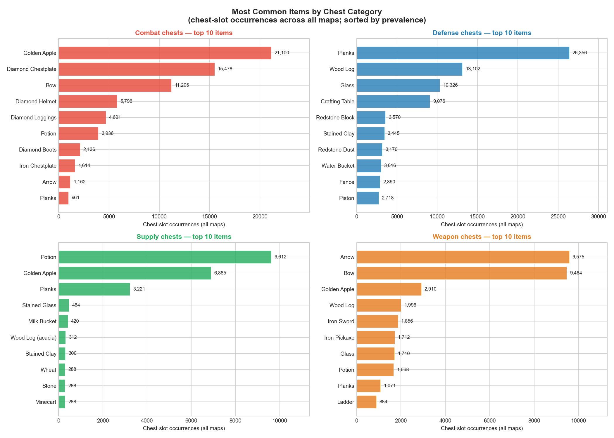
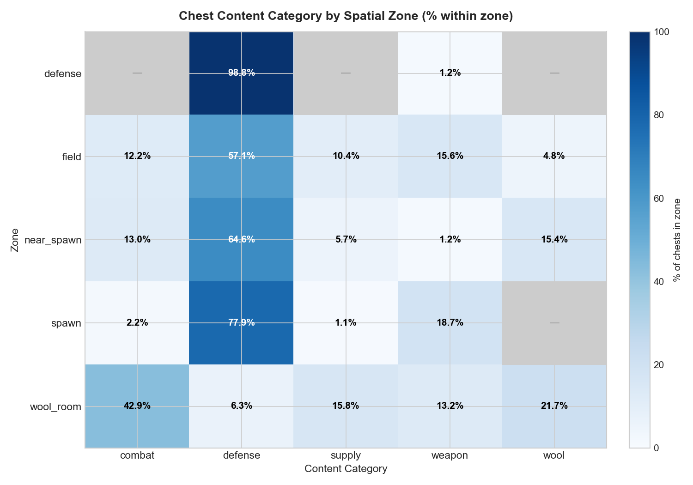
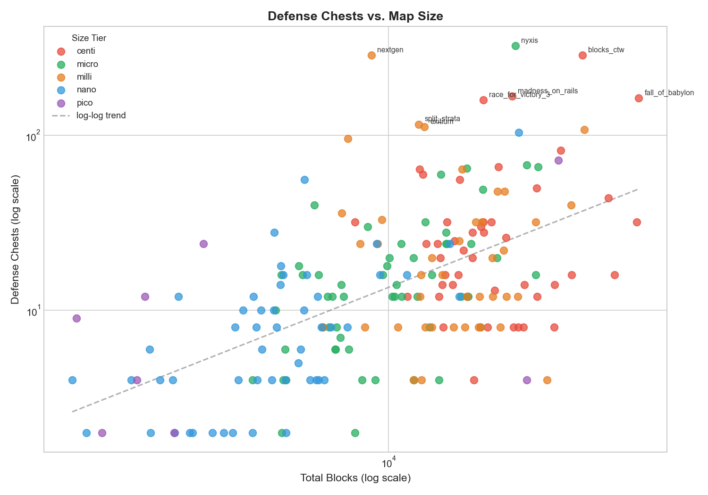
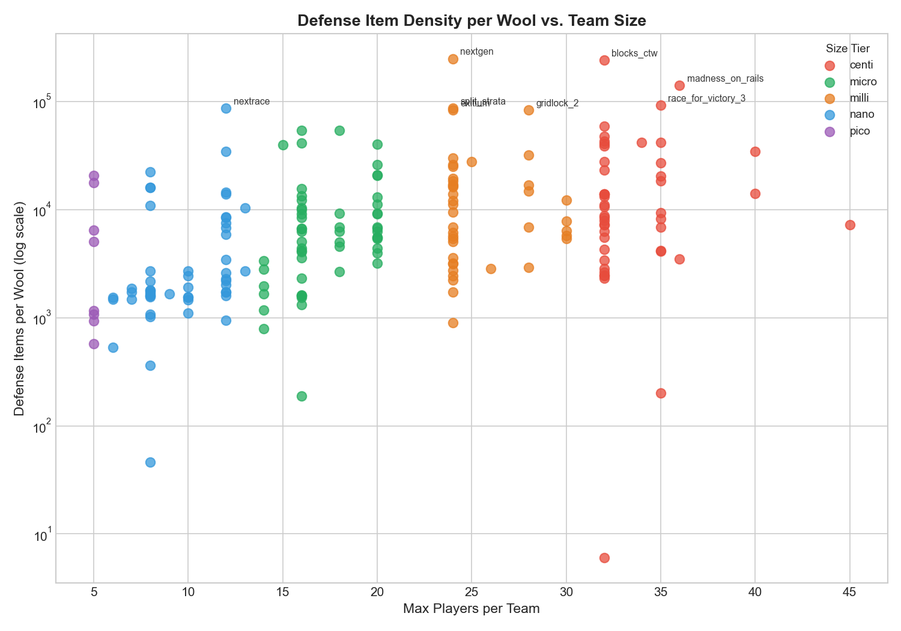
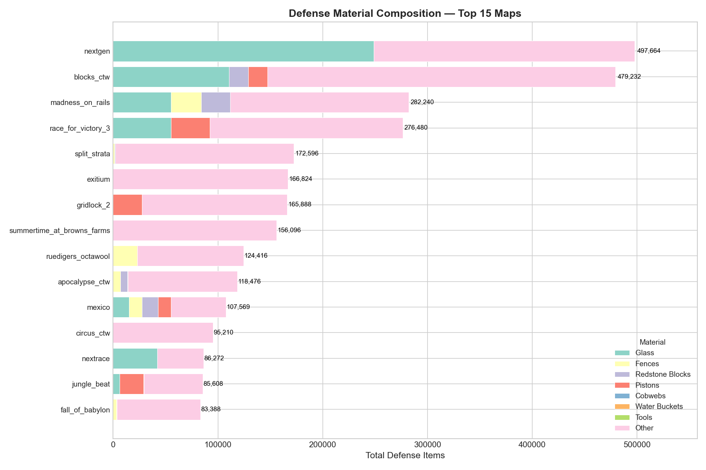

# Chest Spatial Analysis

*Generated 2026-03-25 | Dataset: ~202 non-stub maps with defense-category chests; 12 maps with no defense-category chests*

---

## Classification Schemes

### Content Categories

Every chest in the database is assigned a `content_category` based on the most significant item it contains. Classification uses a fixed priority order so that a chest which holds both armor and a bow is unambiguously labelled as `combat` rather than `weapon`.

| Category | Priority | Classification rule | Gameplay role |
|----------|----------|---------------------|---------------|
| `wool`   | 1 | Contains the wool objective item | Holds the win condition |
| `combat` | 2 | Contains any diamond armor piece | Gear-up chest at the objective; serves both defenders holding the wool room and attackers who have broken through |
| `kit`    | 3 | Contains a weapon AND food AND a tool (pickaxe/axe/shovel) | Legacy full-kit spawn chest from maps that predate the XML `<kit>` module; provides a complete player loadout (weapon, mining tool, food, and blocks) in a single chest |
| `weapon` | 4 | Contains a bow or sword (no armor, no food+tool combo) | True weapon chest; typically a buffed bow with arrows, sometimes a sword |
| `supply` | 5 | Contains golden apples or potions (no armor/weapon) | Attacker re-supply chest; stocked with Splash Speed potions for escaping with the wool, golden apples for the final fight, and building blocks for re-bridging inside the objective |
| `defense`| 6 | Everything else | Building and barrier materials for defenders; the largest single category |

A chest that does not match any of the first four rules falls through to `defense` as the default. This means items like planks, fences, pistons, and crafting tables that are used to seal passages and slow attackers are captured here even when the chest contains no dedicated combat gear.

### Spatial Zones

Each chest is also tagged with the `zone` it belongs to, derived from the map's XML region definitions and island geometry.

| Zone | Location | Typical content | Notes |
|------|----------|-----------------|-------|
| `wool_room` | Inside or immediately adjacent to the wool objective room | combat, wool, supply, weapon | The most contested area; stocked for the final fight |
| `defense` | A fortified chokepoint between the field and the wool room | defense | Near-exclusive defense items (98.8%); the most semantically pure zone |
| `spawn` | In or directly at the team's spawn area | defense, weapon | Respawn resupply hub; players restock immediately after dying |
| `field` | The open contested area between the two teams | defense, weapon, combat | Mixed; defense materials dominate but weapon and combat chests appear for mid-field skirmishing |

---

## Executive Summary

Chest content categories align remarkably well with spatial zones: defense-zone chests are 96.6% defense items, spawn chests are 78% defense + 19% weapon (functioning as resupply stations), and wool-room chests show the richest mix — combat, wool, supply, and weapon all represented. A small number of maps completely dominate the item-count extremes: nextgen and blocks_ctw each have 288 defense chests stocked with ~500K items each, compared to a typical map with 8–32 chests holding a few thousand items. Twelve maps have no defense-category chests, most of which are small pico/nano maps; this does not preclude those maps from having defense materials in spawn or field chests.

---

## Common Items by Category

The chart above shows the top 10 items in each category ranked by *chest-slot occurrences* — the number of individual chest inventory slots containing that item across all maps. This metric avoids distortion from stack sizes (planks stack to 64; diamond armor is always a stack of 1) and gives a cleaner picture of how universally each item appears.

### Defense chests

**Planks (25,496 slots)** are the single most common defense material by a wide margin, followed by **wood logs (12,194)** and **glass (10,050)**. These are all dense, easy-to-place barrier materials. **Crafting tables (9,056 slots)** are fourth — not for crafting, but as an inventory trap: an attacker rushing through the wool room may right-click a crafting table and waste precious seconds closing the unexpected inventory screen. **Redstone blocks (3,570)** are hard and slow to mine, making them an effective high-durability wall layer. **Fences (2,678)** and **pistons (2,506)** complete the classic CTW defense toolkit: fences slow attackers' movement, while pistons (and sticky pistons further down the list) allow defenders to mechanically seal or open gaps.

**Wooden buttons and pressure plates** appear in nearly identical quantities (~2,400 slots each). Placed on top of blocks, they prevent an attacker from placing a block on that surface without first holding shift — a subtle but meaningful defensive nuance that slows bridging and climbing.

### Combat chests

**Golden apples (19,440 slots)** dominate combat chests — over 10,000 more slots than the second-ranked item. In the wool-room fight, a golden apple (temporary absorption hearts) can be the difference between surviving a hit and dying, so stocking them liberally is standard practice. The full diamond armor set (chestplate, helmet, leggings, boots) is represented across the dataset but with very unequal slot counts — chestplates appear far more than leggings and boots — because most maps stock only a single armor piece per chest rather than a complete set. **Potions (3,056)** appear in a meaningful share of combat chests, confirming that Splash Speed potions are distributed across both combat and supply chests rather than being exclusively a supply-chest item.

#### Armor piece combinations

Combat chests almost universally contain a single armor piece rather than a full set. Across 2,742 combat chests on 183 maps:

| Combination | Chests | % | Maps |
|-------------|-------:|--:|-----:|
| Chestplate only | 1,521 | 55.5% | 104 |
| Helmet only | 317 | 11.6% | 30 |
| Leggings only | 307 | 11.2% | 19 |
| Helmet + Leggings | 104 | 3.8% | 6 |
| Leggings + Boots | 98 | 3.6% | 6 |
| Boots only | 95 | 3.5% | 11 |
| Helmet + Chestplate | 89 | 3.2% | 3 |
| Helmet + Boots | 76 | 2.8% | 4 |
| **Full set** | **72** | **2.6%** | **45** |
| Other | 63 | 2.3% | — |

**Single-piece chests account for 81.7% of all combat chests.** The chestplate is the clear favourite — 55.5% of combat chests stock it alone, across 104 of 183 maps. This reflects the chestplate's disproportionate protection value (it covers 8 of 20 armor points on its own).

**The full set is a minority design (2.6% of chests, 45 maps).** Most maps that include all four pieces spread them across separate single-piece chests; a player must loot multiple combat chests to assemble a complete set. Only 45 maps include a chest with all four pieces together, though 48 maps provide all four pieces somewhere across their combat chest pool.

**Notable single-piece profiles at the map level:**

- **Chestplate-only maps (72 maps):** All combat chests on these maps stock only a chestplate. Average 15.6 combat chests per map.
- **Helmet-only maps (21 maps):** All combat chests provide only a helmet — no chestplate appears anywhere. Likely maps where the chestplate is provided through a kit module or simply not included.
- **Leggings-dominant maps:** A cluster of maps — levels (72 chests), madness_on_rails (48), blocks_ctw (24), gridlock_2 (24) — stock leggings exclusively or primarily. Leggings provide the second-most protection of any single piece (6 of 20 armor points) and may be chosen as the "second priority" piece on maps that split the kit between chest types.
- **Helmet + chestplate, no lower body (3 maps — ruedigers_octawool, race_for_victory_3, harbor_ctw):** These large maps (32–56 combat chests each) provide upper-body coverage only. The design may assume players will already have leg/boot coverage from elsewhere, or that upper-body armor is the decisive factor in wool-room combat.

### Supply chests

**Potions lead supply chests (8,164 slots)** — these are primarily Splash Potion of Swiftness, used by attackers to escape the wool room quickly after grabbing the wool. **Golden apples (~8,100 slots)** are nearly equal in prevalence. The large **planks (3,221)** count reflects supply chests stocked with bridging/climbing blocks for attackers who have broken in and need to re-supply quickly. The remaining items (stained glass, logs, wheat, stone) are attacker re-supply building blocks placed near the objective; they are for reaching the wool or escaping, not for general construction.

### Weapon chests

**Bow** and **arrow** are nearly always paired — a true weapon chest almost always provides both, often with enchantments. **Golden apples** appear alongside bows on a significant share of maps, bundling a small combat consumable with the ranged weapon. Some weapon chests include a few building blocks (logs, glass, planks) for setting up a sniper position or bridging lane.

*Note: figures in this section will shift once the `kit` category is applied. Legacy full-kit spawn chests on maps like blocks_ctw and the race_for_victory series were previously captured here because they contain bows and swords. With kit classification in place, those chests are separated out and the remaining weapon chests should skew toward true ranged-weapon setups.*

---

## Zone × Content Category Alignment

The heatmap shows how tightly content categories track spatial zones across the full dataset.

**Strong alignments:**

- **Defense zone → defense (96.6%)** — The classification pipeline is highly consistent here. The remaining 3.4% is a small number of weapon and combat chests in what the spatial classifier identifies as the defense buffer zone — plausibly bows or swords stocked just outside the wool room entrance.
- **Wool room → combat (41.5%)** — Wool rooms are not just about wool retrieval; they are heavily contested and designers stock them accordingly. Combat items (armor, gapples, potions) make up over 40% of chest content. Wool (23.6%), supply (15.2%), and weapon (13.7%) round out what is functionally an arena preparation zone. A 6.0% defense fraction reflects maps that also cache building materials inside the wool room itself.
- **Spawn → defense (77.7%) + weapon (18.6%)** — Spawn chests are resupply hubs. Players respawn and immediately restock on blocks and gear. The high weapon proportion (mostly bows) makes sense as spawn is also where players tool up before pushing out.

**Surprises and nuances:**

- **Spawn → weapon (18.6%)** — Higher than expected. This reflects maps that place a weapon chest at spawn rather than in the field, giving every respawner immediate ranged gear.
- **Field → defense (66.4%)** — Two-thirds of field chests are still classified as defense. This is not surprising on maps where defense materials are distributed across the whole layout rather than concentrated in a single room, but it means field chests are often not neutral resupply; they bias toward building blocks.

---

## Defense Chest Distribution

There is a broadly positive relationship between map size (total blocks) and defense chest count, as expected — larger maps need more distributed resupply points. However, the log-log trend line hides enormous variance; map design philosophy dominates over raw size.

**Outliers above the trend (many chests relative to their size):**

- **nyxis** (micro, 21,881 blocks) leads in raw chest count at **326 chests** with only 40K items total — meaning each chest is small (averaging ~123 items). This is consistent with a map design that places many single-purpose or partially stocked chests throughout the layout rather than a few dense ones. With only 1 wool per team the defense is undivided.
- **nextgen** and **blocks_ctw** both hit **288 chests** but carry ~500K items each — massive stocked chests. nextgen is a milli map (9,000 blocks), unusually small for that item count, suggesting the defense chests are extremely dense in a compact area. blocks_ctw is a centi map (33K blocks) with a similarly extreme density.
- **madness_on_rails** (centi, 168 chests) and **fall_of_babylon** (centi, 164 chests) represent the high end of conventional large-map defense stocking.

**Outliers below the trend (few chests for their size):**

- **harbor_ctw** (centi, 46K blocks — one of the largest maps) has only 32 defense chests with 14K items. This map's size comes from a large open layout where combat happens at range rather than in defensible chokepoints, reducing the need for distributed resupply.
- **frost** (centi, 40K blocks) similarly has only 16 defense chests. Large maps do not automatically mean many defense chests.
- **ad_infinitum** (milli, 33K blocks, 108 chests) is an interesting case: many chests but very few items per chest (total 6,364 items = ~59 items each). This map distributes access without stocking heavily.

---

## Defense Intensity per Wool

Normalising by wools per team reveals how much material is provisioned per objective — a proxy for how hard each wool is intended to be defended.

**Extreme outliers:**

| Map | Wools/team | Defense Items | Items/wool | Team size |
|-----|-----------|--------------|-----------|-----------|
| nextgen | 2 | 497,664 | 248,832 | 24 |
| blocks_ctw | 2 | 479,232 | 239,616 | 32 |
| madness_on_rails | 2 | 282,240 | 141,120 | 36 |
| race_for_victory_3 | 3 | 276,480 | 92,160 | 35 |
| split_strata | 2 | 172,596 | 86,298 | 24 |
| nextrace | 1 | 86,272 | 86,272 | 12 |
| exitium | 2 | 166,824 | 83,412 | 24 |
| gridlock_2 | 2 | 165,888 | 82,944 | 28 |

nextgen and blocks_ctw sit roughly 3–4× above the next cluster. These are maps where the wool room is a fundamentally different kind of obstacle — less "raid the chest, build a wall" and more "the chest IS the wall" (literal glass/piston/redstone mechanics).

**The bulk of the dataset** (maps with 2–4K items per wool) clusters in the lower-left: small teams, few items per wool, conventional defence stocking. The pattern suggests per-wool intensity scales weakly with team size — 35-player centi maps and 8-player nano maps can both have low item-per-wool counts. What drives extreme density is design philosophy, not player count.

**Maps with only 1 wool per team** show high variance: nyxis (40K items, 1 wool = 40K items/wool) is a modest number compared to nextrace (86K/wool). When there is only one wool to defend the stakes are higher and some designers stock accordingly.

---

## Material Composition Outliers

The stacked bar chart for the top 15 maps by total defense items reveals distinct design archetypes:

**Glass-wall maps:**
- **nextgen** (248K glass out of 498K total, ~50%) — The defence is built almost entirely from glass. On a milli map with only 9K total blocks, the glass volume implies enormous pre-placed or chest-stocked glass walls are the primary mechanic. Almost nothing else in the chests.
- **blocks_ctw** (111K glass out of 479K total) — Glass is the largest single material but shares the stacking with 18K redstone blocks and 18K pistons. This is the classic redstone-piston defence paradigm combined with glass barricades.
- **race_for_victory_3** (55K glass + 37K pistons) — Similar archetype, double-wool. Pistons and glass in roughly 2:1 ratio.

**Fence-dominated maps:**
- **madness_on_rails** (29K fences + 55K glass + 28K redstone) — The largest fence stockpile in the top 15 combined with heavy glass and redstone. This map uses all three structural materials simultaneously, suggesting layered defences.
- **ruedigers_octawool** (23K fences, almost nothing else) — An octawool pico map (7 wools, 5-player team). The entire defence budget goes to fences — perhaps wooden barriers around each of the 7 wool rooms with minimal other material.

**Piston-heavy maps:**
- **blocks_ctw** and **gridlock_2** (28K pistons) — Piston traps or retractable walls. gridlock_2 has 28K pistons and nothing else tracked, implying the entire defence mechanic is piston-based.

**Maps with near-zero tracked materials despite large item totals:**
- **exitium** (167K items, zero tracked materials) — All items fall into the "Other" category. This is likely dominated by building materials not in the tracked set (stone, wood, logs, planks, etc.). Exitium's defence is probably straightforward block-stacking.
- **summertime_at_browns_farms** (156K items, zero tracked) — Same pattern. A nano map with 8 players and 7 wools, suggesting many small chests stocked with basic blocks rather than specialised mechanics.
- **split_strata** (173K items, only 768 redstone blocks and 1280 fences tracked) — The vast majority of items are "other."

The "Other" category dominates many maps and likely includes common building materials (planks, logs, cobblestone) that are tracked as defense items in the classification but were not individually broken out as named materials in this figure.

---

## Maps with No Defense-Category Chests

The following 12 non-stub maps have no chests classified as `content_category = 'defense'`. This does not mean they have no defense materials — spawn and field chests on these maps may still contain building blocks; the classifier simply found no chest whose dominant item fell into the defense category.

| Map | Size tier | Total blocks | Max players/team | Wools/team |
|-----|-----------|-------------|-----------------|-----------|
| blossom_ctw | micro | 6,370 | 16 | 1 |
| cargo | micro | 6,088 | 16 | 2 |
| catscratch | nano | 4,016 | 12 | 1 |
| desert_eclipse | micro | 12,433 | 16 | 3 |
| fairy_tales_2_mini | nano | 5,219 | 10 | 2 |
| greenhill | micro | 8,066 | 16 | 2 |
| ingwaz | pico | 2,039 | 5 | 1 |
| no_mans_land | centi | 11,105 | 32 | 2 |
| ouroboros | nano | 10,335 | 10 | 1 |
| prisma_ctw | nano | 4,529 | 6 | 1 |
| stalactites_a_land_down_under | micro | 9,518 | 18 | 2 |
| cake_day | centi | 15,063 | 35 | 2 |

A few observations:

- **Most are small maps**: 10 of 12 are pico/nano/micro. The exceptions are no_mans_land and cake_day (both centi).
- **cake_day** and **no_mans_land** are legitimate full-size maps. Their absence of defense-category chests reflects a design choice rather than an absence of materials — cake_day has chests in the field and spawn zones that provide building blocks, but none are classified as `defense` content. Players defend using available terrain and spawn supplies rather than a dedicated defense chest pool.
- **ouroboros** is unusual in this list: its wool-room chests are stocked with combat and supply gear, but nothing in the defense category. The map has players spawn directly below the wool room, so the layout relies on natural terrain chokepoints rather than pre-placed barrier materials.
- These maps may rely on **spawn chests only** (classified under the spawn zone) for any resupply, or may have a design philosophy where raiding is straightforward and defense emerges from player skill rather than material fortification.

---

## Appendix: Notable Outliers — Top 10 Maps by Defense Chests

| Map | Tier | Total Blocks | Players/team | Wools/team | Defense Chests | Defense Items | Items/wool |
|-----|------|-------------|-------------|-----------|---------------|--------------|-----------|
| nyxis | micro | 21,881 | 20 | 1 | 326 | 40,242 | 40,242 |
| nextgen | milli | 9,000 | 24 | 2 | 288 | 497,664 | 248,832 |
| blocks_ctw | centi | 33,099 | 32 | 2 | 288 | 479,232 | 239,616 |
| madness_on_rails | centi | 21,432 | 36 | 2 | 168 | 282,240 | 141,120 |
| fall_of_babylon | centi | 46,904 | 34 | 2 | 164 | 83,388 | 41,694 |
| race_for_victory_3 | centi | 17,952 | 35 | 3 | 160 | 276,480 | 92,160 |
| split_strata | milli | 12,062 | 24 | 2 | 116 | 172,596 | 86,298 |
| exitium | milli | 12,472 | 24 | 2 | 112 | 166,824 | 83,412 |
| ad_infinitum | milli | 33,479 | 30 | 1 | 108 | 6,364 | 6,364 |
| summertime_at_browns_farms | nano | 22,356 | 8 | 7 | 104 | 156,096 | 22,299 |

**ad_infinitum** stands out as a contrast to the other top-10 entries: 108 defense chests but only 6,364 total items — an average of ~59 items per chest, the lowest density in this group by far. This map distributes access points widely but stocks them sparingly. **summertime_at_browns_farms** is the sole nano map here and the only map with 7 wools per team in the top 10; its 104 chests spread across 7 wool objectives average ~14 chests per wool, a very high ratio.
