# Ingwaz — Map Demo

Visual walkthrough of the analysis pipeline output for the **Ingwaz** Capture the Wool map.

> Regenerate these images with:
> ```
> python docs/demo/generate_demo.py --map Ingwaz
> ```

---

## Block Layout

Individual blocks from the bedrock layer, colored by island assignment.
Team islands appear in red/blue, neutral islands in gray.
Star markers show spawn points and wool objectives.

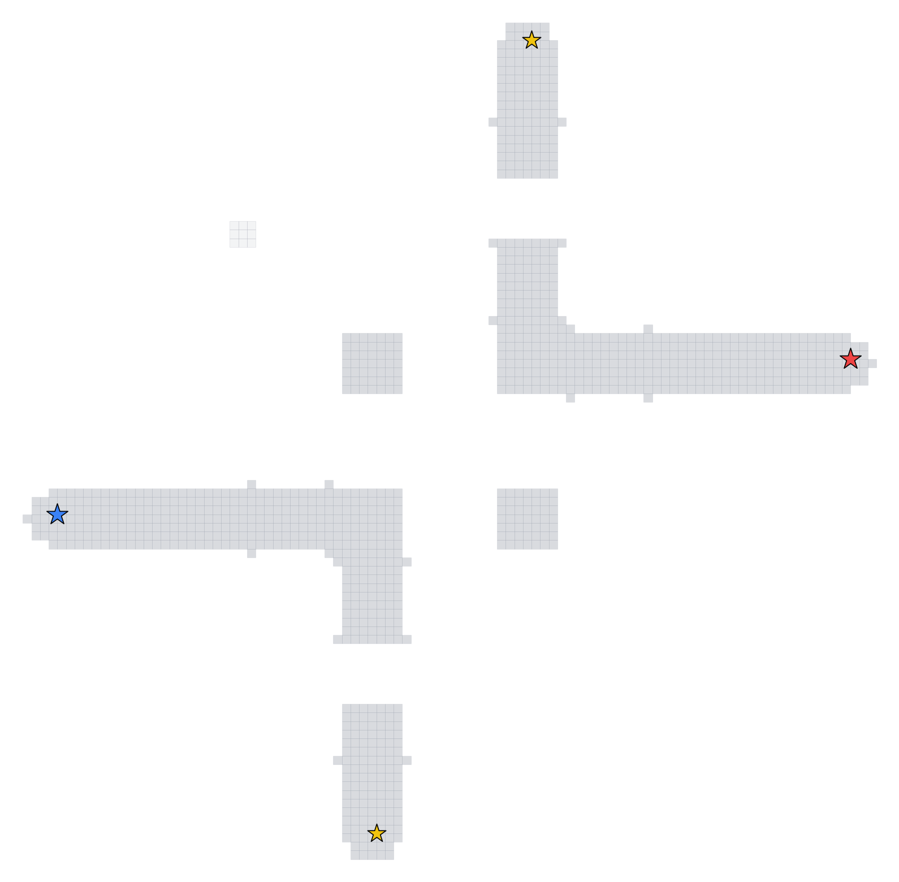

## XML Regions

Build region (green overlay) parsed from the map XML, with island polygon
outlines and POI markers. The build region represents the area where players
can place blocks during the match.

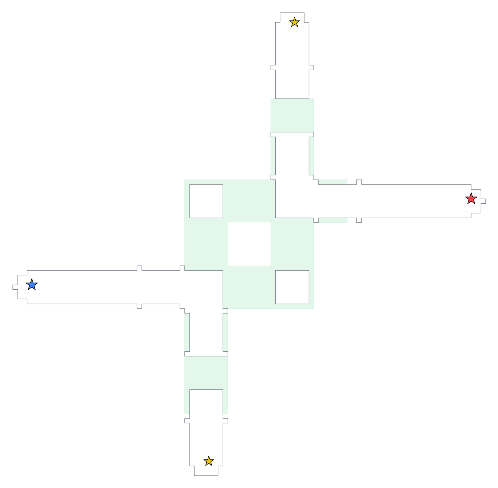

## Skeleton Overlay

Topological skeleton extracted from each island's shape. Skeleton edges
(light blue) trace the medial axis of each island, with endpoints (dark blue)
and junction nodes marking key positions.

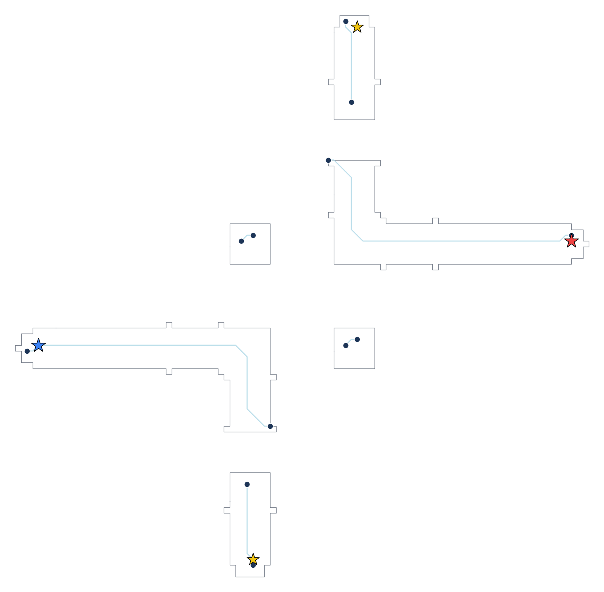

## Island Outlines

Simplified polygon outlines of each detected island. These polygons are
derived from the block layout via alpha-shape triangulation and polygon
simplification.

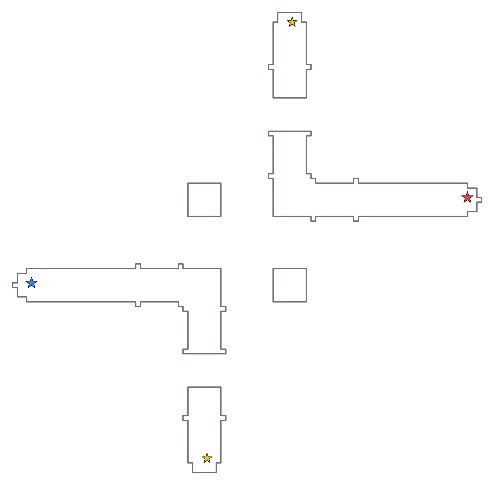

## Connectivity Graph

Full map connectivity showing all layers: build region, island outlines,
skeleton paths, and void links (red dashed lines) connecting islands across
open space. Void link thickness is inversely proportional to distance.

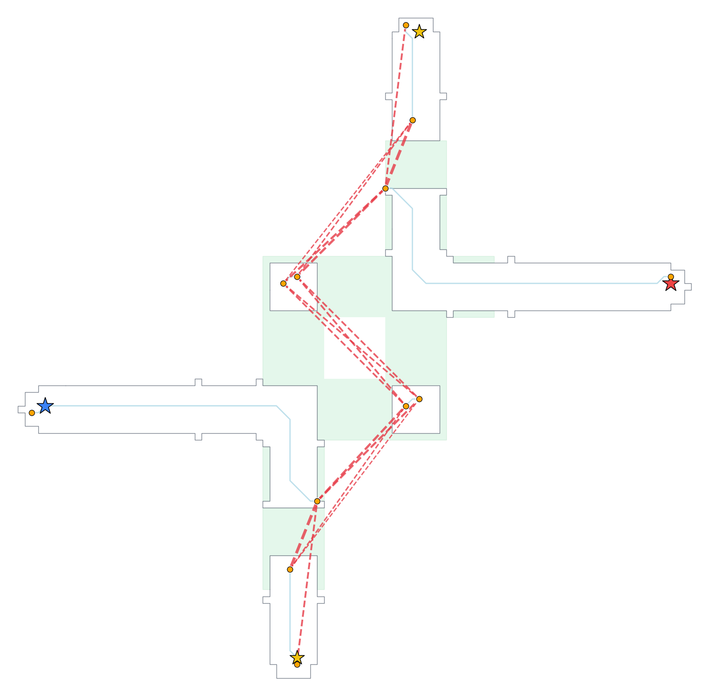

## Player Trace (Single Player)

Position trace for a single player across all life segments in one match.
Each life (spawn to death) is drawn in a distinct color, showing movement
patterns and engagement areas.

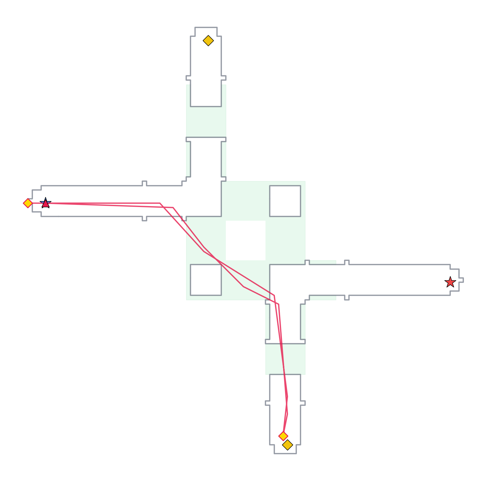

## Player Traces (Team View)

All players in a match colored by team assignment (red vs blue).
Useful for understanding team-level movement patterns and territory control.

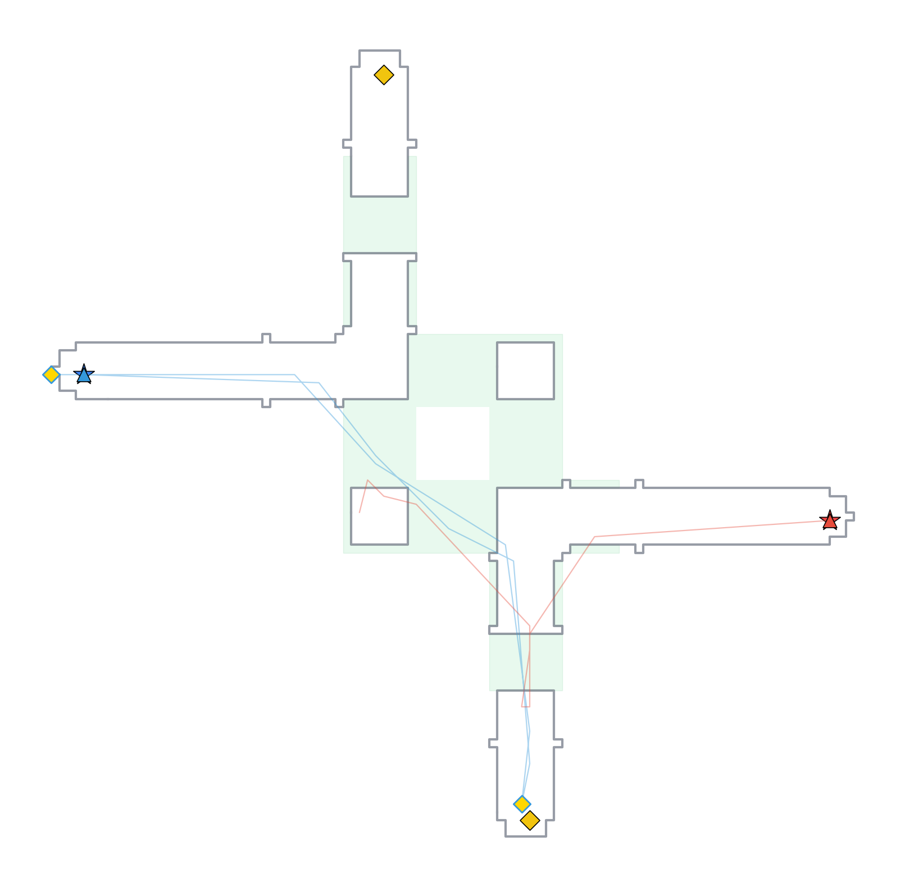

---

# Tumbleweed — Match Data Processing Demo

Visual walkthrough of the **match data processing pipeline** using a live match
on the **Tumbleweed** Capture the Wool map (match recorded 2026-01-24, 141 players,
75 minute duration).

> Regenerate these images with:
> ```
> python docs/demo/generate_demo.py --map tumbleweed --match 3 --player 21
> ```
>
> The pipeline to produce match data before running this script:
> ```
> python ctw.py run --all
> python ctw.py maps load
> python ctw.py maps spawns
> python ctw.py matches index --match-dir match_logs
> python ctw.py matches process-all
> python ctw.py matches post-process --all
> ```

---

## Map Structure

The Tumbleweed map features a linear layout with two team bases connected by
a central bridge region. Nine islands total, with 180-degree rotational symmetry.

### Block Layout

Bedrock layer blocks colored by island assignment. Team islands face each other
across the central void, with neutral islands forming the mid-section.

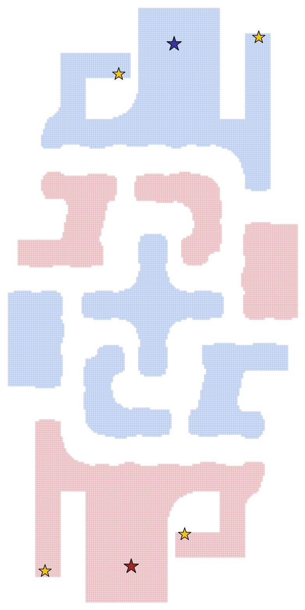

### XML Regions

Build regions (green overlay) parsed from the map XML. The long central bridge
section spans most of the map's length, defining where players can construct.

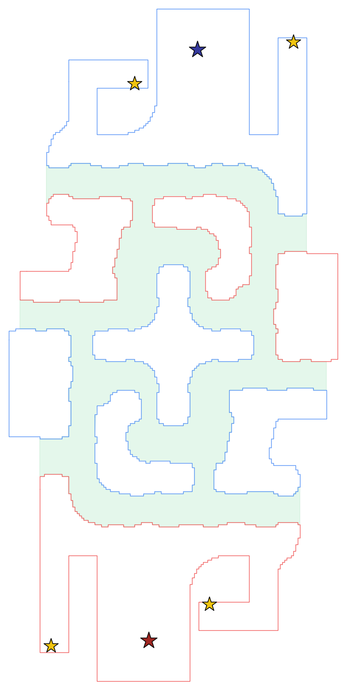

### Skeleton Overlay

Topological skeleton of each island showing the medial axis (light blue paths)
and key structural nodes: endpoints (dark blue) mark entry/exit points,
junction nodes (gray) mark branching locations used for role classification.

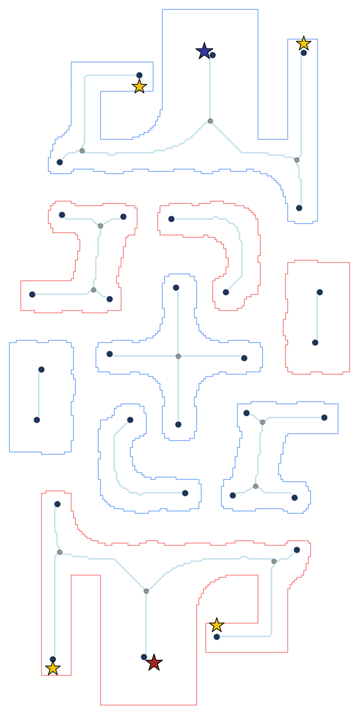

### Island Outlines

Simplified polygon outlines derived from the block layout. The elongated shapes
of Tumbleweed's islands reflect its linear map design.

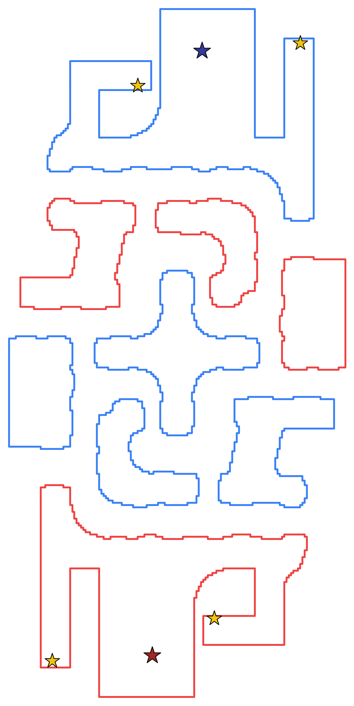

---

## Match Analysis

Once match logs are indexed and processed, the pipeline extracts per-player
life segments — each life from spawn to death — annotated with spatial context
(which island, build region, or void the player occupied at each tick).

### Player Trace — Single Player

Position trace for the top-fragging player (blue team, 20 lives, 68 kills)
across all life segments in the match. Each life is drawn in a distinct color.
The tight clustering near the enemy base reflects consistent offensive pressure.

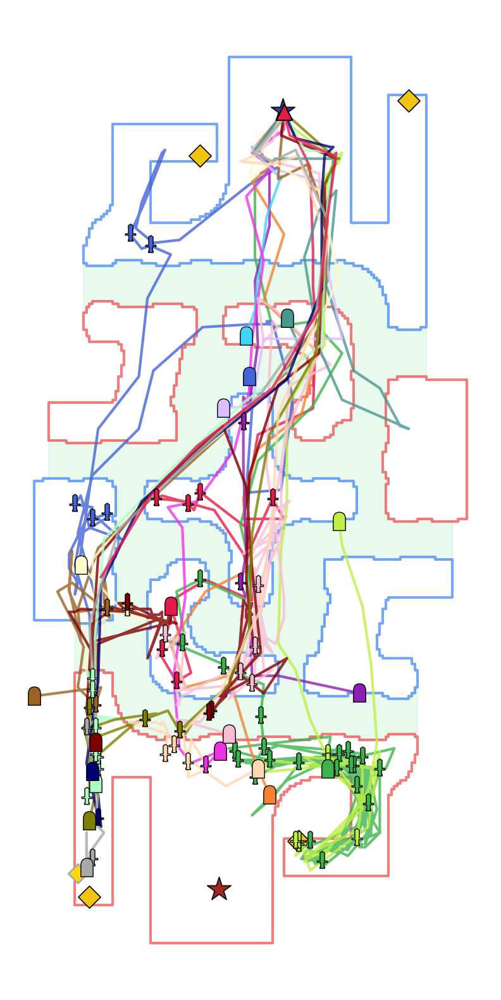

### Player Traces — Full Team View

All 141 players colored by team (blue vs red). The density distribution reveals
team territory control: blue players concentrated around the enemy wool rooms,
red players defending and contesting the central bridge area.

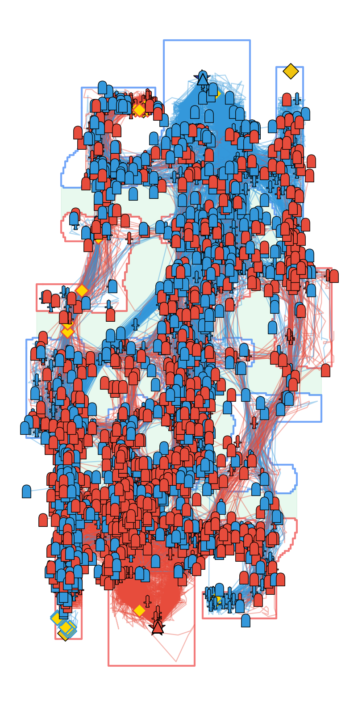

### Match Time Series

Per-team attack depth and death rate over the course of the match (60-second
buckets). Attack depth measures how close players are to the enemy wool objectives
on average — a depth of 1.0 means players are at the wool, 0.0 means they are
at spawn. Triangle markers (▲) indicate wool touches, stars (★) indicate captures.

The 75-minute match shows sustained blue-team pressure with multiple deep pushes,
while red's depth spikes indicate counter-attacks. The negative push-pull correlation
(−0.41) confirms a back-and-forth dynamic between the two teams.

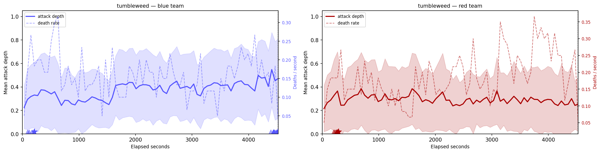

### Player Role Archetypes

Life segments are clustered into behavioural archetypes using unsupervised learning
on spatial features derived from the skeleton graph. Each bar shows how many lives
each archetype was played, broken down by team:

| Archetype | Description |
|---|---|
| **deep-attacker** | Consistently pushes deep into enemy territory; high kill rate |
| **attacker** | Objective-focused; pushes deep with moderate home-island time |
| **bridge-fighter** | Spends most time in build/void regions between islands |
| **defender** | Stays almost exclusively on home island; rarely departs |
| **outlier** | Edge cases; lives on neutral islands or very short durations |

The tumbleweed match shows a high proportion of attackers and bridge-fighters,
consistent with its long central corridor design encouraging sustained mid-map combat.

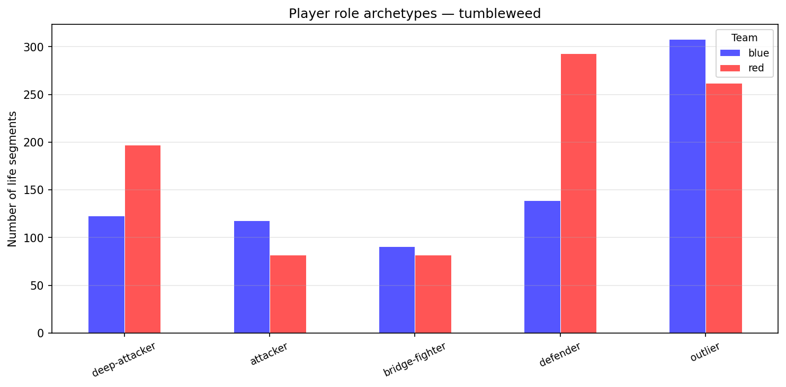

---

## Wool Dynamics

Deep analysis of objective play from the `wool_dynamics` notebook.  Four views
examine how each wool was contested throughout the match — from raw node coverage
to reconstructed carry attempts.

> Regenerate with:
> ```
> jupyter nbconvert --to notebook --execute notebooks/wool_dynamics.ipynb
> ```

### Per-Wool Node Coverage

For each of the four wool objectives, defender and attacker tick-counts at the
wool's skeleton node are plotted per 60-second bucket.  Triangles (▲) mark wool
touches; stars (★) mark captures.

The asymmetric defence pattern is clear: **lime** and **orange** wools (bottom
half) were captured early (~t=200–250 s) because attacker ticks vastly
outnumbered defender ticks.  **Cyan** (top) had heavy blue-team coverage the
entire match and was never captured.  **Yellow** was held until the final minutes
when blue finally overwhelmed the defence.

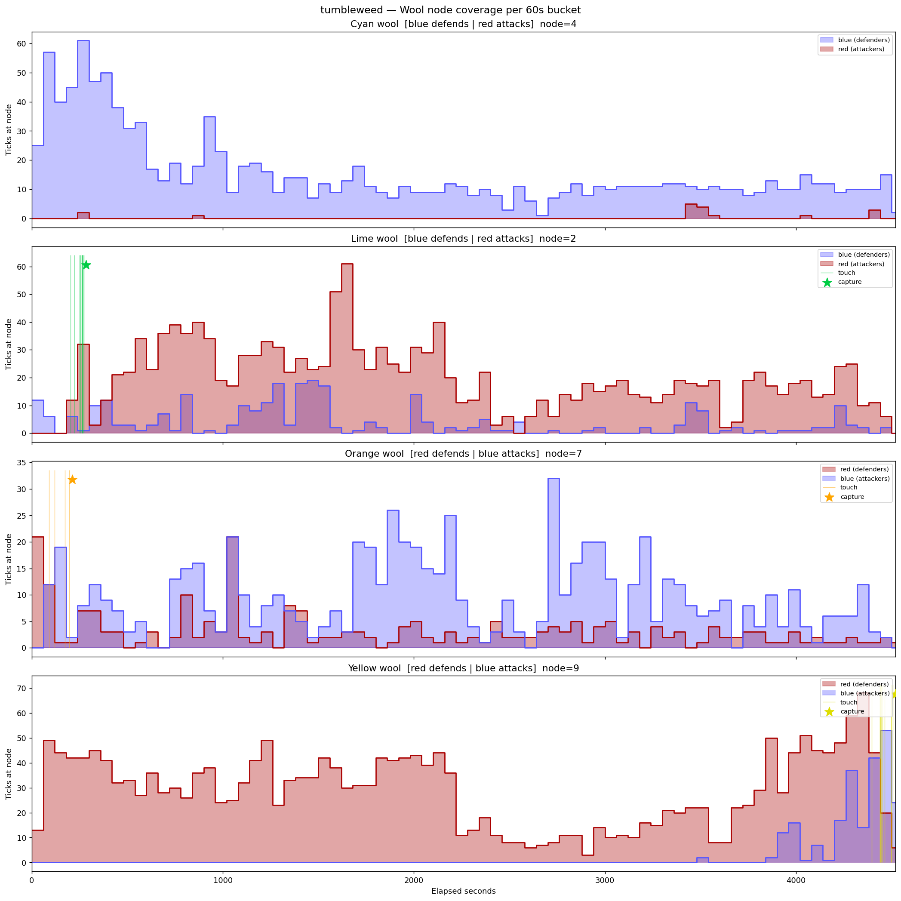

### Y-Level Phase Detection

Rolling 5-minute median player Y per team reveals the transition from ground-level
play to skybridge-level play.  The left panel shows both teams trending upward from
Y ≈ 10 (ground) toward the skybridge threshold (Y = 22, dashed) late in the match.
Blue's median Y crosses the threshold ~t = 3500 s, roughly 60 minutes in.

The right panel confirms bimodality: the early-game Y distribution peaks at Y ≈ 10
(ground layer), while the late-game distribution develops a second peak at Y = 29
(max build height) — the skybridge itself.

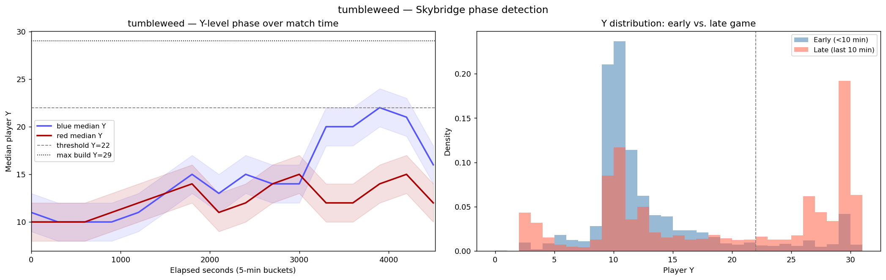

### Per-Wool Attack Depth

Attack depth measures how close attacking players are to each wool objective
independently (`depth = 1 − dist / baseline`), averaged per 60-second bucket.

Both series sit well below 0.5 for most of the match, reflecting the long travel
distance from spawn to wool.  The slight upward trend for **yellow wool** (blue
attacks, top panel) toward the end of the match corresponds to the late skybridge
push that eventually secured the capture.

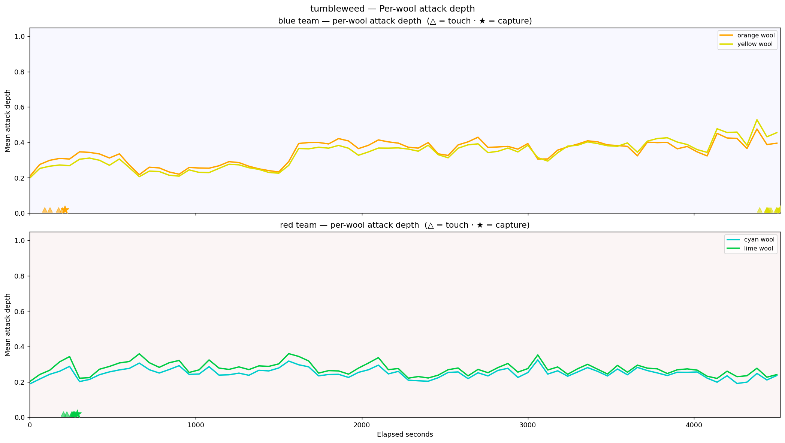

### Wool Carry Chain Timeline

Gantt chart of every reconstructed carry wave.  Each bar spans the first touch to
capture/loss, coloured by the carrying team (blue / red), hatched by outcome.
Annotation shows handoff count (+N↔) and approach type (sky / gnd).

| Wool | Carrier | Outcome | t (s) | Handoffs | Approach |
|---|---|---|---|---|---|
| orange | blue | captured ★ | ~250 | 3 | ground |
| lime | red | captured ★ | ~200 | 9 | ground |
| yellow | blue | captured ★ | ~4 450 | 9 | ground |

All three captures in this match were ground-level approaches — the skybridge was
constructed but used for map control rather than as a direct wool-room entry route.

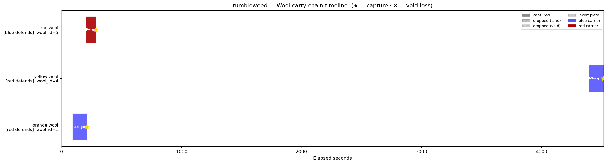

---

## Traffic Graph Diagnostics

The pipeline is transitioning from the **skeleton graph** (a topological medial-axis
graph derived from map geometry) to a **traffic graph** — a denser, data-driven graph
built by aggregating player position samples and movement transitions across many matches.

Each grid cell (5 × 5 blocks) that accumulates enough player visits becomes a node;
frequently-traversed cell-to-cell moves become edges.  With 877 nodes and 5,669 edges
for this single match, the traffic graph is roughly 10× denser than the skeleton and
far closer to where players actually move.

> Regenerate with:
> ```
> python scripts/run_traffic_diagnostics.py --map tumbleweed
> ```

**Terminology used throughout these images:**
- **Observed** — raw position samples (~2 s apart) and nearest-node snapped anchors.
  These are ground truth, directly recorded from the match.
- **Inferred** — intermediate graph nodes along the reconstructed shortest path between
  two consecutive snapped anchors.  Players may have traversed multiple edges between
  samples; this layer fills in the probable route, but is *not* directly observed.

**Heuristic selection criteria:**
- **deep_attacker** — segment whose snapped anchors reach the minimum Dijkstra distance to an *enemy* wool node
- **defender** — segment with the lowest average Dijkstra distance to the player's *home* wool nodes, no wool touch, ≥ 8 positions
- **roamer** — highest combined score of path tortuosity × log(unique_nodes), with span ≥ 40 blocks and unique nodes ≥ 12
- **traversal** — maximum Euclidean distance between first and last raw position sample

### Traffic Graph Overview

The full traffic graph for Tumbleweed, built from one match (1,695 life segments,
50,423 position events, 141 players).  Node size scales with visit count; edge colour
and thickness scale with transition frequency (YlOrRd scale, thin=rare, thick=common).
Diamond markers show wool nodes; square markers show spawn nodes.

Key observations:
- Dense corridors along the main bridge and island interiors match the gameplay flow.
  High-traffic edges clearly trace the dominant attacker approach routes.
- Both team islands show star-shaped node clusters radiating from the wool room, with
  a clear high-traffic hub near each spawn.
- Low-traffic fringe nodes at island edges correspond to less-visited defensive positions
  and build-region traversals.
- The graph visually validates that the 5-block grid resolution captures the main gameplay
  pathways without being so fine-grained as to become noisy.

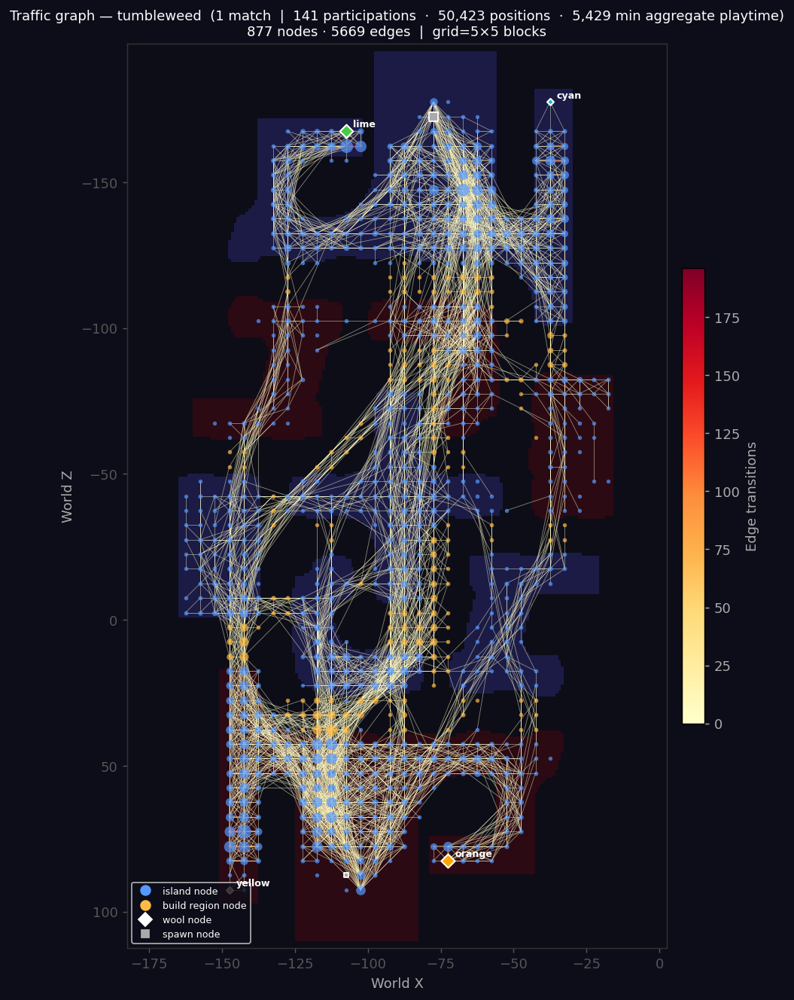

### Diagnostic Figures — Panel Key

Each of the four figures below uses a consistent 6-panel layout:

| Panel | Contents |
|-------|----------|
| **A** | Raw position samples only (ground truth, temporal colour: purple → yellow) |
| **B** | Raw positions overlaid on the full traffic graph (coverage check) |
| **C** | Snapped node sequence — one nearest-graph-node per sample, raw (includes repeats) |
| **D** | Reconstructed path between consecutive snapped anchors using **dense-hop** mode (inferred) |
| **E** | Simplified snapped sequence after consecutive-dedup (removes immediate repeats) |
| **F** | Metadata summary: duration, sample counts, span, tortuosity, wool contact |

---

### Deep Attacker

**Segment:** player 0, life 11 · 156 s · 23 positions · 16 unique snapped nodes
· span 249 blocks · tortuosity 1.20 · wool contact: yes

Selected because its snapped sequence reached the minimum Dijkstra distance to an
**enemy** wool node across all 1,577 qualifying segments.  Tortuosity of 1.20 means the
player's snapped trajectory length was only 20% longer than the straight-line
first-to-last distance — a nearly direct push toward the objective.

Panel B shows raw positions sitting on the high-traffic corridors leading into the
enemy wool room, confirming good graph coverage in the attack zone.  Panel C's snapped
sequence traces a directed path deep into enemy territory.  Panel D uses **dense-hop
reconstruction** (edge weight = distance²/grid_size), penalising long void-crossing
edges quadratically so that Dijkstra routes through the fine-grained short-hop
neighbourhood rather than jumping across the void.  Panel E (simplified) removes
repeated anchor pairs, leaving a clean directed sequence from spawn to objective.

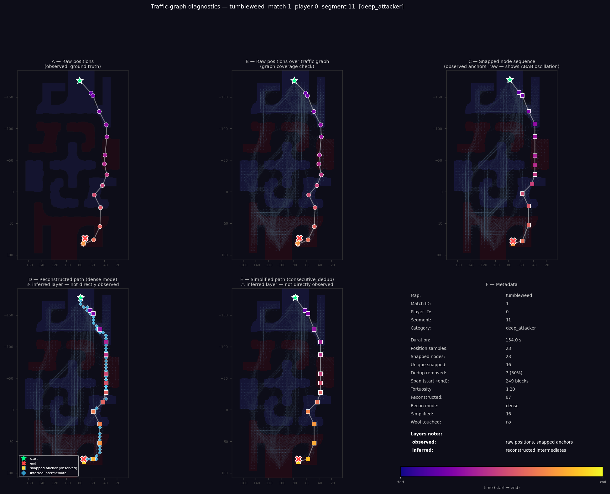

---

### Defender

**Segment:** player 47, life 0 · 2874 s (~48 min) · 461 positions · 28 unique snapped nodes
· span 55 blocks · tortuosity 31.17 · wool contact: no

Selected by **lowest average Dijkstra distance to home wool nodes** among segments with
≥ 8 positions and no wool touch.  The player spent nearly the entire match within a small
area of their own island centred on the home wool room, patrolling without ever reaching
enemy territory.  Tortuosity of 31 means the total path traced was ~31× the start-to-end
displacement — a tight continuous patrol loop rather than any directional movement.

Panel C is the key inspection panel: a large number of positions mapped to 28 distinct
nodes, almost all tightly clustered around the home wool area.  Repeated back-and-forth
between adjacent nodes is visible in the temporal colour pattern (neighbouring nodes
alternate purple → yellow → purple as the player passes the same spot repeatedly).
Panel E collapses the immediate repeats to give a cleaner picture of which sub-area is
being patrolled.  Panels D and E closely mirror each other — there are enough samples
here for the reconstructed path to be dense and locally accurate.

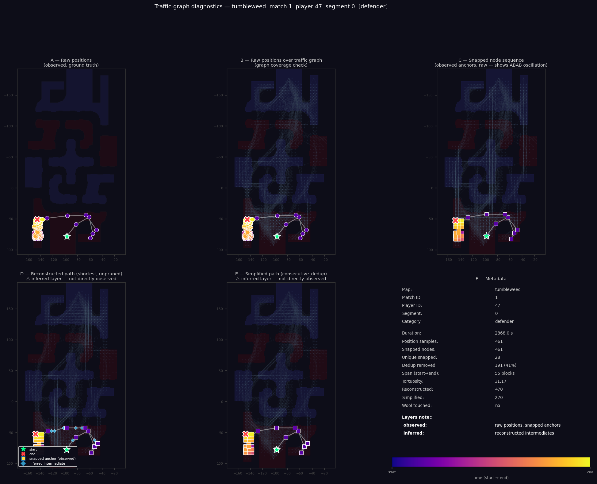

---

### Roamer

**Segment:** player 66, life 0 · 4189 s (~70 min) · 780 positions · 94 unique snapped nodes
· span 50 blocks · tortuosity 100.46 · wool contact: no

Selected by highest **tortuosity × log(unique_nodes)** score among segments with
span ≥ 40 blocks and ≥ 12 unique nodes.  With 94 distinct snapped nodes visited and a
tortuosity of 100 — meaning the total path length was 100× the net displacement — this
player covered an enormous amount of ground over a ~70-minute life while ending up close
to where they started.  This is the signature of a mid-map fighter or roaming supporter:
lots of diverse node coverage, repeated passes across the same corridors, and no
sustained directional push.

Panel C is dense and visually complex: 780 positions mapped to 94 unique nodes shows
the graph being exercised across a wide area, not concentrated in one room.  Panel D's
reconstructed path is correspondingly large — many inferred intermediate hops filling
the space between every pair of sampled anchors.  Panel E reduces the sequence to its
unique-node visits only, giving a much cleaner picture of the spatial footprint.

> **Key inspection point:** Does Panel E's simplified sequence show the roamer
> circling a central area, or crossing back and forth along a single corridor?
> That distinction will matter for role classification.

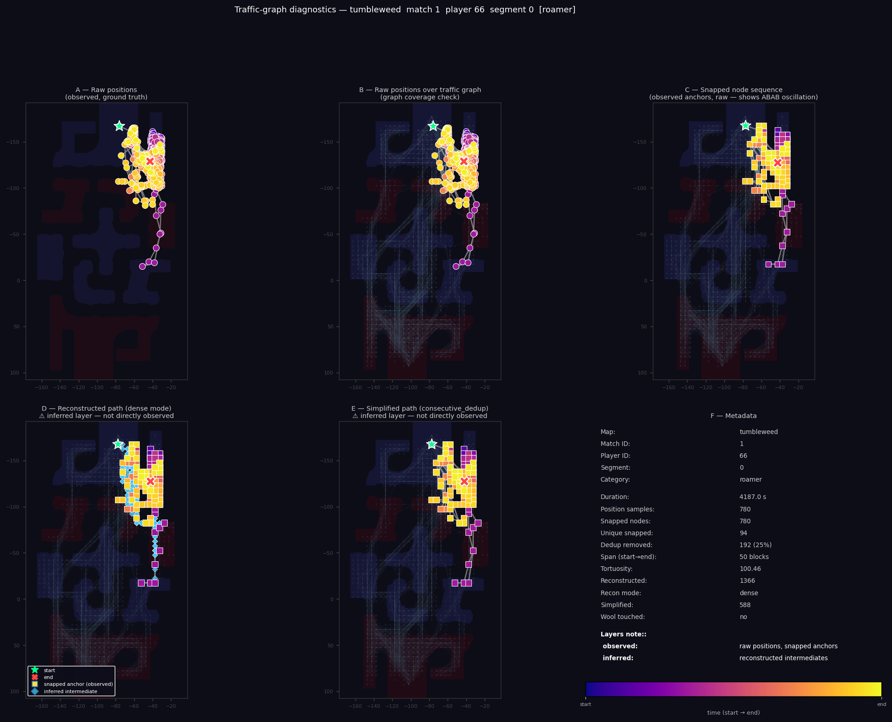

---

### Long Traversal

**Segment:** player 58, life 5 · 234 s · 45 positions · 27 unique snapped nodes
· span 276 blocks · tortuosity 1.70 · wool contact: no

Maximum first-to-last Euclidean span across all segments.  27 unique snapped nodes from
45 samples and a tortuosity of only 1.70 confirm this is a near-straight run across
a large fraction of the map — almost certainly a player running from spawn toward the
enemy base or vice versa.

Panel B shows positions spread across most of the map's width, confirming genuine
long-range movement.  Panel C's snapped sequence traces a clear directional path.
Panel D's reconstructed path is the most useful one for evaluating reconstruction
quality: with dense-hop mode the inferred path follows the traffic corridors from
the overview plot rather than taking void-crossing shortcuts.  A 30-block void jump
costs 180 in dense mode vs. 30 for six 5-block hops, so the reconstructed route
stays on the main bridge corridor.  Tortuosity of 1.70 is already a good sign —
the snapped path is only 70% longer than the straight line.

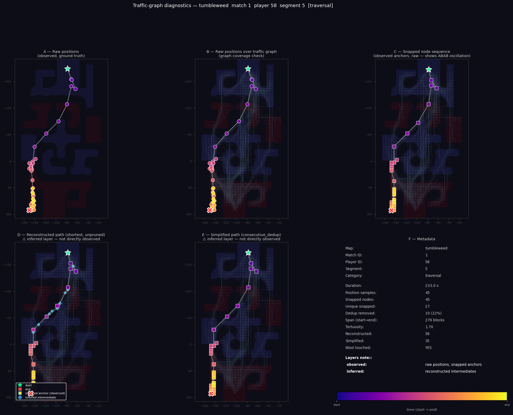

---

### Findings Summary

| Question | Observation |
|----------|-------------|
| Does nearest-node snapping look locally accurate? | Yes — Panel B shows positions sitting on or very near graph nodes in high-traffic zones. The 5-block grid size appears well-matched to position sample density. |
| Is the snapped sequence stable enough as an anchor representation? | Yes for directed movement (attacker, traversal). Defender and roamer show dense local revisits, but those appear behaviorally real rather than snapping noise. |
| Is home-wool proximity a good defender signal? | The selected defender (player 47, 48 min life, low span, near home wool) is a far better example than the previous spawn-proximity heuristic, which just found an idle player. |
| Is tortuosity a good roamer signal? | The selected roamer (94 unique nodes, tortuosity 100) reflects genuine map-wide coverage with no net displacement. Inspect Panel E to confirm circular vs. corridor movement. |
| Does dense-hop reconstruction avoid void jumping? | Yes — the traversal segment is the best test case. With linear edge weights a 30-block void jump was cheaper than going around; dense mode (dist²/grid_size) makes that jump 6× more expensive than six 5-block hops, routing the reconstructed path along the bridge corridor. |
| Is simplification useful? | Consecutive-dedup reduces the defender and roamer panels significantly, making spatial footprints much clearer without removing meaningful oscillation structure. |
| Next step? | Examine Panel C vs E for the roamer to determine whether back-and-forth between distant nodes (vs. local oscillation) drives the high tortuosity — this will inform whether "roamer" needs its own classifier cluster. |

---

### Extended Heuristics — Item and Elevation Signals

Four additional segments were selected using combat, elevation, and held-item signals
extracted from position samples.  Kill `held_item` was not recorded in this match
(pre-plugin-update gap), so held-item characterisation is based on what the player
was holding at each ~2 s position sample — which is actually richer for role inference
since it covers the entire life rather than only kill moments.

**Panel A colour encoding for held-item plots:**

| Colour | Category | Item IDs (examples) |
|--------|----------|---------------------|
| **Amber** `#ff8c00` | Bow | BOW (203) |
| **Red** `#ff3333` | Sword / Axe | IRON_SWORD (209), DIAMOND_AXE (221) |
| **Green** `#44ff88` | Bridge block | GLASS (20), WOOD (5), STAINED_CLAY (159) |
| **Yellow** `#ffdd44` | Tool | IRON_PICKAXE (199), DIAMOND_PICKAXE (220) |
| **Gray** `#888888` | Other / empty | AIR (0), food, misc |

For the **skybridge** plot Panel A is coloured by y-level using a
cool (low) → warm (high) gradient.  A colourbar on the panel shows the
min/max y range for the segment.

---

#### High Killer

**Segment:** player 21, life 1 · 1084 s · 215 positions · 62 unique snapped nodes
· span 226 blocks · tortuosity 8.53 · **kills: 21**

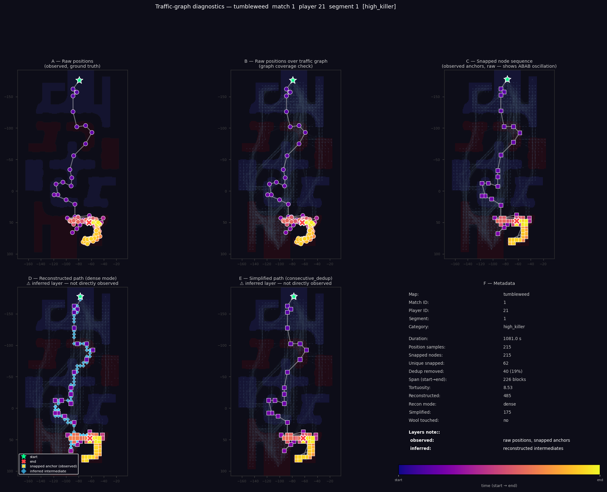

The most kills recorded in a single life across the entire match.  Panel A shows
wide-ranging movement — a 226-block span with tortuosity 8.53 indicates repeated
pushes and retreats across the map rather than camping in one corner.  Panel C's
dense snapped sequence reflects frequent engagement zones.  Panel D reconstructs
the full trajectory including inferred intermediate hops; the high kill count
combined with non-trivial span suggests an aggressive roaming fighter rather than
a spawn-camping kill farmer.

---

#### Skybridge Controller

**Segment:** player 0, life 20 · 300 s · 51 positions · 19 unique snapped nodes
· span 176 blocks · frac\_elevated 96% · avg y 27.5

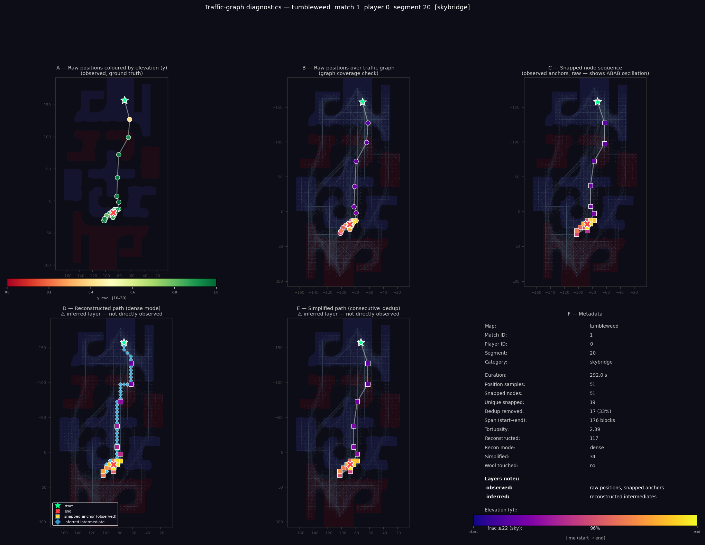

96% of position samples were recorded at y ≥ 22 (the skybridge threshold), making
this the most elevation-dominant life in the match.  Panel A is coloured by y-level:
nearly all dots are warm (high y), confirming the player spent the entire life on or
above the skybridge rather than touching ground level.  Panel B shows the snapped
positions concentrated on the high-elevation portion of the traffic graph.
The 176-block span indicates the player traversed a significant horizontal distance
along the bridge — consistent with extending or defending it rather than simply
standing still.

---

#### Bow Archer

**Segment:** player 0, life 16 · 70 s · 14 positions · 10 unique snapped nodes
· span 134 blocks · frac\_bow 100%

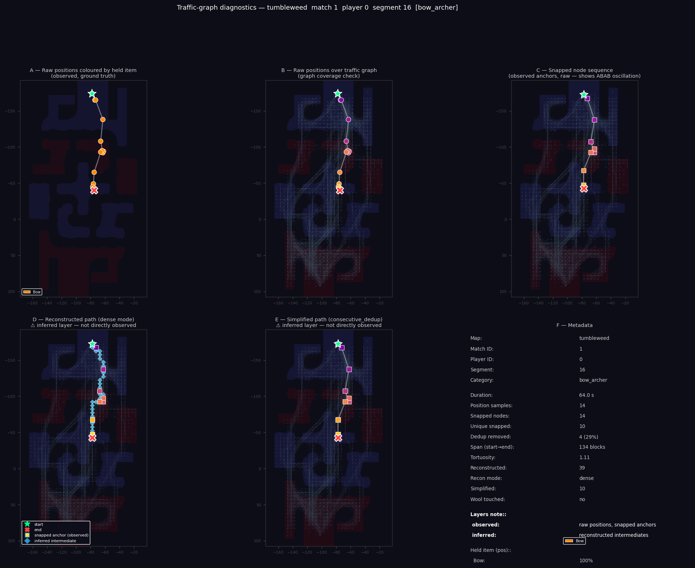

Every position sample in this life recorded the player holding a BOW (item 203).
Panel A shows all positions in amber — the item-category colour for bow.  With a
134-block span and 100% bow-hold rate the player was clearly in a sustained
ranged combat posture while crossing significant ground.  Panel F's held-item
breakdown confirms the single-category dominance.  This is the strongest bow-archer
signal in the dataset; note that 70 s is a short life, consistent with aggressive
bow use that typically leads to faster deaths in open fights.

---

#### Builder

**Segment:** player 0, life 1 · 93 s · 15 positions · 14 unique snapped nodes
· span 217 blocks · frac\_builder 100%

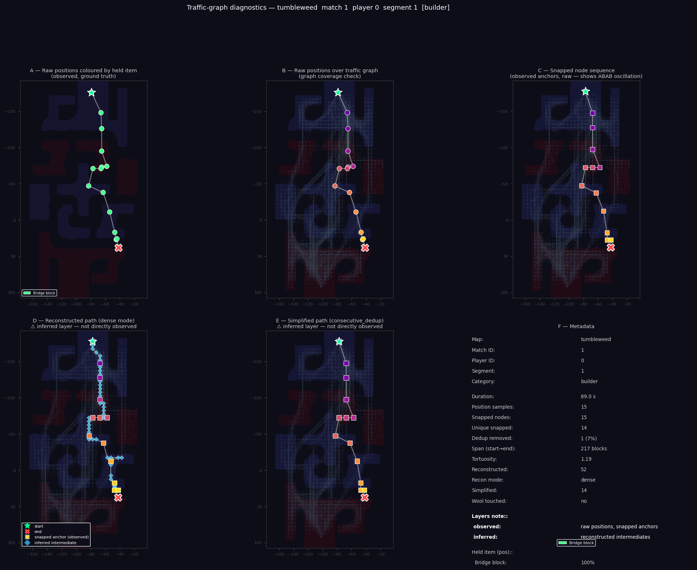

Every position sample shows the player holding a bridge block (100% builder
fraction).  Panel A positions are uniformly green — the item-category colour for
building materials.  The 217-block span with only 15 positions and 14 unique nodes
indicates a fast, linear movement across the map: consistent with placing blocks
continuously while crossing a skybridge or void corridor at speed.  Panel D's
reconstructed path should trace one of the main bridge corridors; dense-hop
weighting prevents the path from jumping directly across void sections that
weren't actually bridged.

---

### Extended Findings

| Question | Finding |
|----------|---------|
| Is kill count a useful discriminator? | Yes — the top killer (21 kills, player 21) shows wide-ranging map coverage rather than static camping, confirming kills correlate with active engagement across multiple zones. |
| Does elevation (avg y) reliably identify skybridge players? | Yes — the skybridge segment has frac\_elevated=96%, avg y=27.5, and a 176-block horizontal span. Static elevated players (sitting on a tower) would have low span; this one moved. |
| Does frac\_elevated need a span filter? | Yes — without a minimum span, single-point elevated structures would score identically. A 20-block span requirement filters out static campers. |
| Is position held\_item a viable role signal despite missing kill held\_item? | Yes — 100% bow and 100% builder segments were found, showing position-held items are a strong and cleanly separable signal even at short life durations. |
| Should held-item plots use temporal or category colouring in Panel A? | Category colouring — it immediately reveals item composition without the user needing to look at Panel F statistics. Temporal colouring is still used in Panels B–E for sequence context. |

---

## Defense Setup Analysis

Early-game defense setup can be inferred entirely from position data and held items.
Every player's first life (`segment_idx = 0`) starts at match second 0, making it a
clean proxy for "early game."  The analysis focuses on positions within 60 Dijkstra
blocks of the home wool node — the defended objective.

Four observable defense phases:

| Phase | Signal | Item IDs |
|-------|--------|----------|
| **Wall building** | y stable 9–25, wool_dist < 15, holding solid blocks | WOOD(5), GLASS(20), COBBLESTONE(4), STAINED_CLAY(159)… |
| **Pit digging** | y drops to 2–5 near wool, holding pickaxe/shovel | IRON_PICKAXE(199), DIAMOND_PICKAXE(220), IRON_SPADE(198)… |
| **Trap placement** | y near pit floor, holding fence/plate/button/cobble wall | FENCE(85), STONE_PLATE(70), WOOD_BUTTON(143), COBBLE_WALL(139), WORKBENCH(58)… |
| **Gate building** | y elevated, holding fence gate | FENCE_GATE(107), wood-type FENCE_GATEs(183–187) |

**Target wool selected automatically** — the node with the most `y < 5` positions
within 30 Dijkstra blocks (richest digging signal).  For this match: **wool 278**
(blue team), 74 active players in the 60-block zone, 1623 positions with y < 5.

**Lane section view** — the right panel in the overview uses Dijkstra distance from
the wool node as the x-axis (topology-aware lane distance, immune to lane curves) and
raw y-level as the y-axis.  This produces a cross-section of the defense corridor
showing spatial separation of phases.

---

### Defense Overview

**Wool 278 (blue team) · 74 players · 5518 zone positions · 1623 dig events (y < 5)**

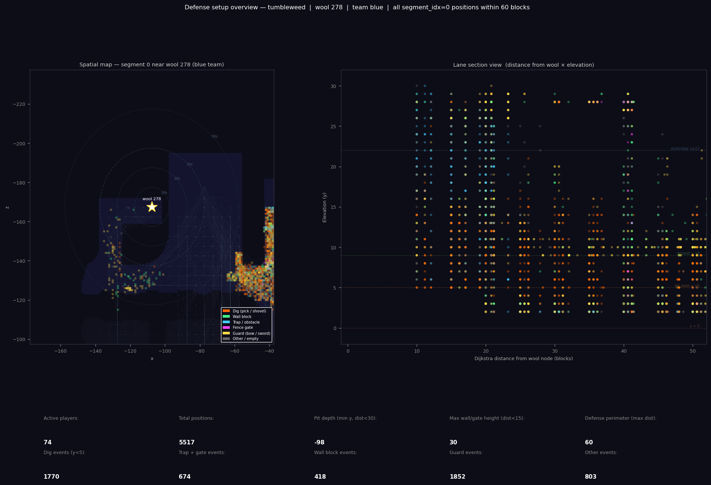

**Spatial map (left):** All first-life positions within 60 Dijkstra blocks of wool 278,
coloured by activity.  Dig (orange) and guard (amber) dominate the close-in area.
Dashed rings at 10 / 20 / 30 / 50 blocks from the wool mark defense zones.

**Lane section (right):** Dijkstra distance × y-level cross-section.  Orange dig events
cluster at y = 2–5 within the first 30 blocks — the pit is being excavated immediately
adjacent to the wool.  Green wall events sit at y = 9–20 at near-zero distance — players
are building the outer wall before the pit is dug.  Cyan trap events fill the y = 0–8
band once the pit is complete.  The amber guard layer at y = 9–15 spans the full 0–50
block range as players patrol the corridor throughout.

**Summary stats:** Pit depth y = 2, max wall/gate height y = 30, defense perimeter
extends to the edge of the 60-block zone.

---

### Early Digger

**Segment:** player 7, life 0 · first life · 648 positions · min y near wool = 2 · frac_trap = 2%

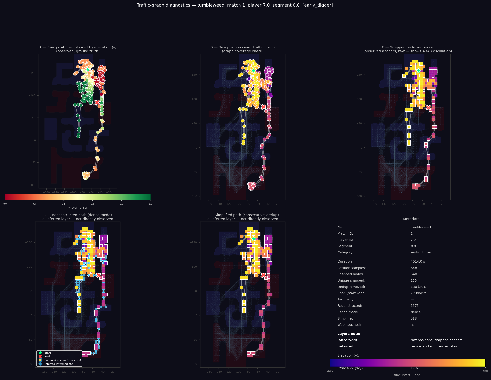

Panel A is coloured by y-level (cool = low, warm = high).  The cool cluster near wool 278
confirms this player spent significant time at y = 2–5 in the immediate wool area —
deep pit excavation.  Panel B overlays the traffic graph: the snapped positions sit within
the first 1–2 hops of the wool node, confirming minimal lateral movement during digging.
Panel C's snapped sequence shows high node-repeat clustering (same 2–3 nodes repeatedly)
consistent with digging in place rather than traversing the map.  Panel F reports min_y
near wool.

---

### Early Builder

**Segment:** player 24, life 0 · first life · 157 positions · min y near wool = 2 · frac_trap = 43%

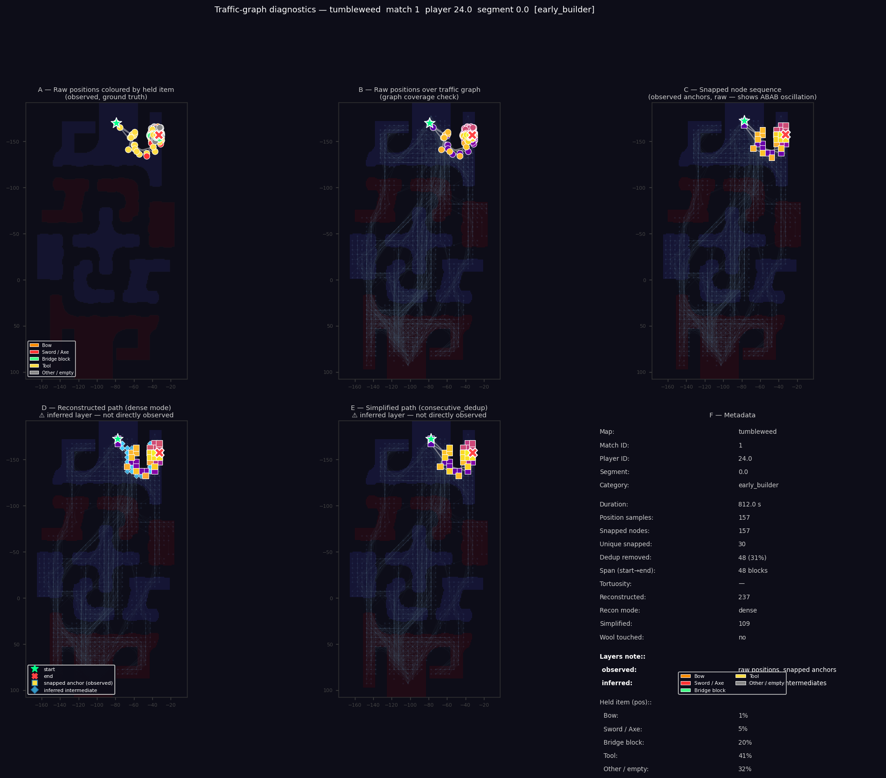

Panel A is coloured by held-item category.  Cyan (trap/obstacle) dominates — 43% of
position samples show this player holding fence, fence gate, pressure plate, workbench,
or cobblestone wall items.  Green (wall block) and magenta (gate) samples confirm
mixed building activity.  Panel B shows the player staying within ~15 Dijkstra blocks
of the wool.  Panel E (simplified sequence) reveals the compact spatial footprint:
fewer unique nodes than the digger, consistent with a builder who plants traps in a
fixed zone rather than traversing the lane.

---

### Defense Analysis Findings

| Question | Finding |
|----------|---------|
| Can pit digging be detected from position data alone? | Yes — y < 5 within 30 Dijkstra blocks of wool, combined with pickaxe/shovel held items, is a clean signal. Player 7 reached y = 2 (below bedrock floor level on some maps). |
| Are defense phases spatially separable? | Yes — the lane section view clearly separates wall events (y 9–25, dist < 15), pit events (y 2–5, dist < 30), and trap events (y 0–8, dist < 30). Guard patrol spans the full distance range. |
| How far does defense extend? | Defense perimeter (max dist for dig/trap/gate/wall activity) reaches the edge of the 60-block zone, suggesting the first line of defense is actually pushed ~50 blocks down the lane from the wool in this match. |
| Is fence gate a distinct signal from other trap items? | Yes — gate (magenta) samples are sparse but visible in the builder segment and the overview. Gate builders appear to work at a different y level (near max build height) from general trap placers. |
| Does segment_idx=0 reliably capture early-game setup? | Yes — all 141 players' first lives start at match second 0, and the defense activity (pit + wall + trap) is concentrated before any deaths occur (player 7's first life lasts the full match at 4519 s). |

---

# Improved Traffic Graph — Five-Map Validation

The Tumbleweed traffic graph above was built with the original fixed 5×5 grid
using all available matches (including 5 s-sampled data). Three data-quality
improvements were subsequently implemented and validated across five maps with
diverse characteristics. See the full report at
[`docs/traffic_graph_improvements.md`](../traffic_graph_improvements.md).

## Data Quality Improvements

| Problem | Fix |
|---------|-----|
| Mixing 2 s and 5 s-logged matches inflates edge lengths | New `log_interval` column on `matches`; graph uses only 2 s data by default |
| `y <= 0` positions (fallen-out-of-world) pollute node set | SQL filter `AND pe.y > 0` |
| Long hops between islands create void-crossing phantom edges | Bresenham line interpolation: reject any hop where an intermediate cell lacks player data |

## Adaptive Grid Size

Fixed 5-block cells are too coarse for small maps and too fine for large ones.
The new default computes grid size from playable block count:

```
grid_size = max(2, round(sqrt(total_blocks / 300)))
```

This keeps node counts stable (270–460) across a 14× size range:

| Map | Blocks | Grid | Nodes | Edges |
|-----|--------|------|-------|-------|
| dromedary | 1 466 | 2 | 457 | 1 355 |
| expedition | 2 300 | 3 | 302 | 839 |
| research_base | 2 808 | 3 | 326 | 906 |
| dynamo | 2 957 | 3 | 270 | 754 |
| level_up | 20 288 | 8 | 374 | 1 234 |

## Strategy Comparison

The `--compare` flag generates a 6-panel figure comparing grid-5, grid-3,
adaptive grid, and k-means/Voronoi strategies side-by-side.

### Dromedary — tiny map, 10 islands

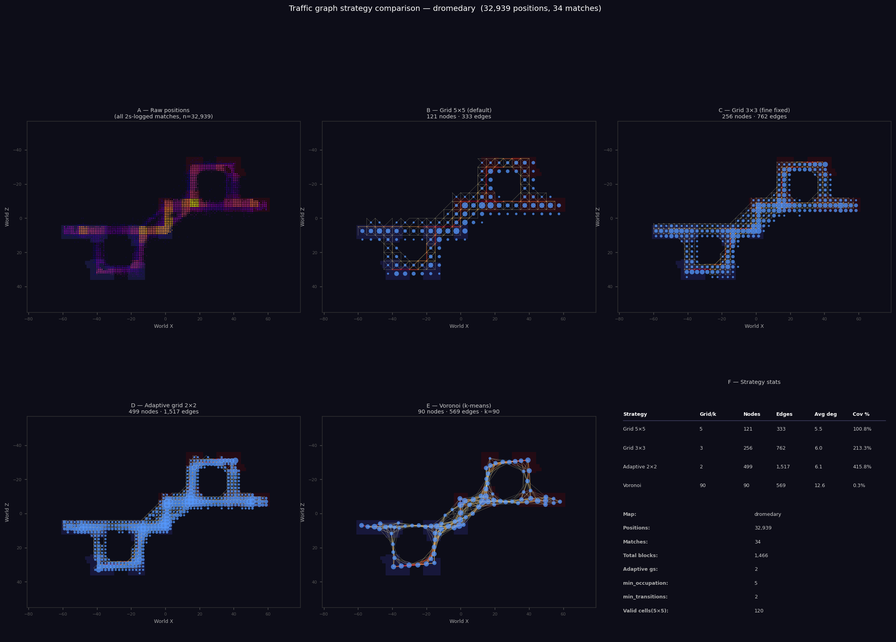

### Dynamo — medium map, highly elongated (171×37)

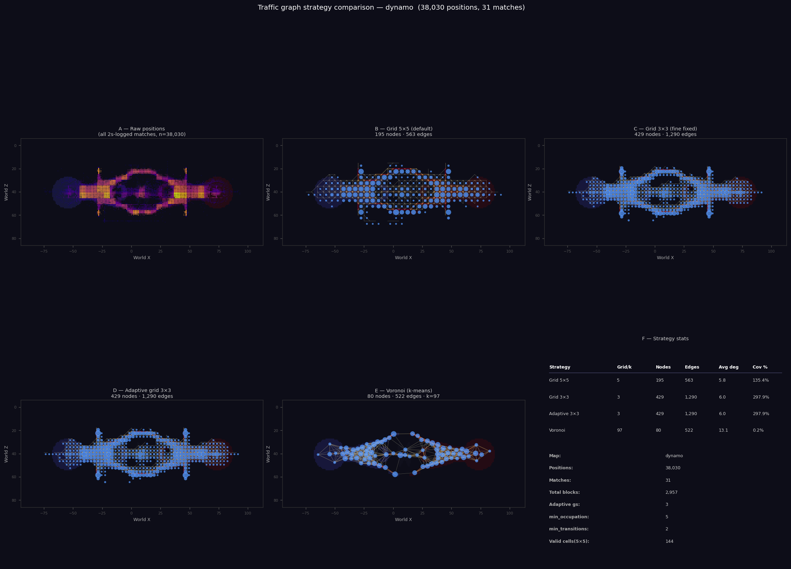

### Level Up — large map, 4-tier bridge structure

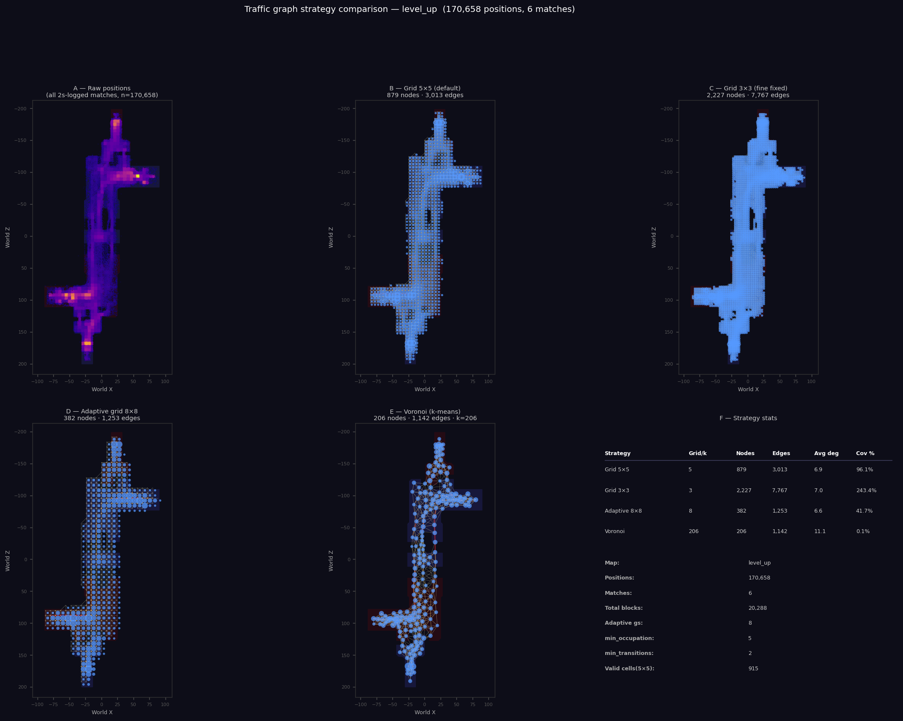

## Wool-Capture Path Validation

Representative deep_attacker life-segments were selected for each map and
inspected for snapping quality. 3 of 5 had confirmed wool captures:

### Dromedary — wool captured

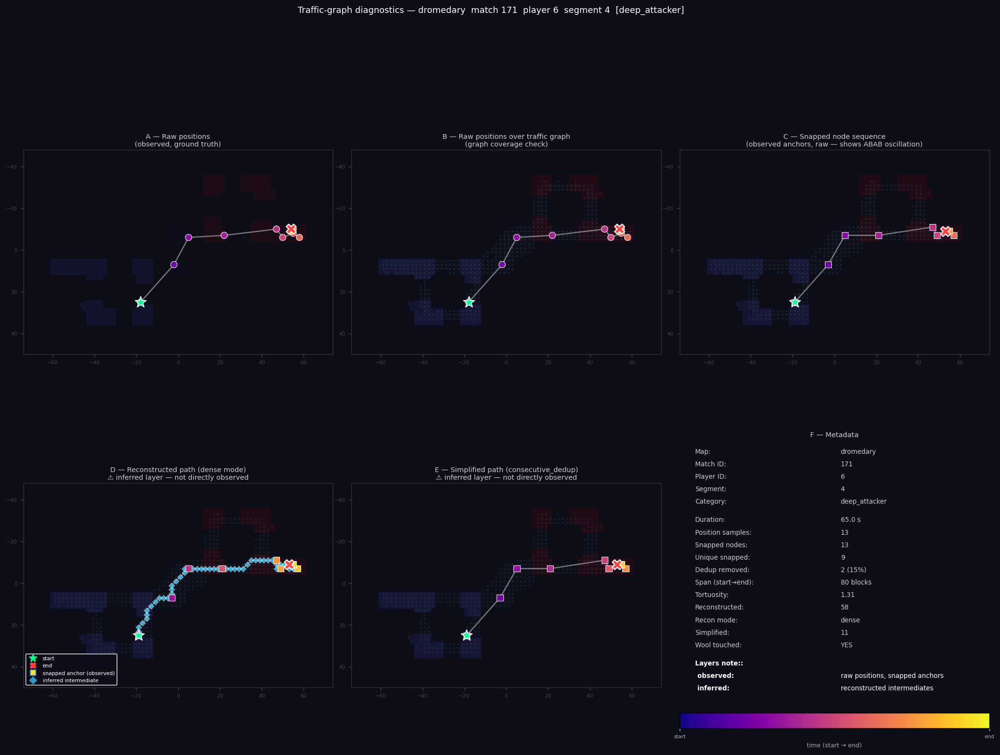

### Research Base — wool captured

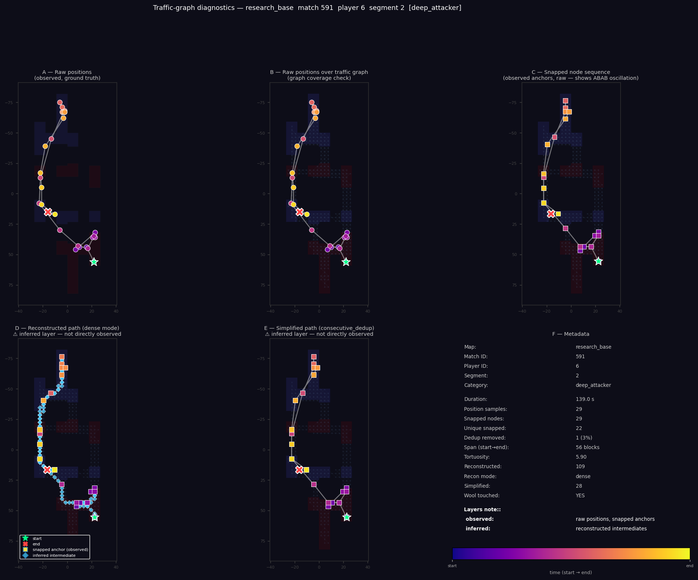

### Dynamo — wool captured

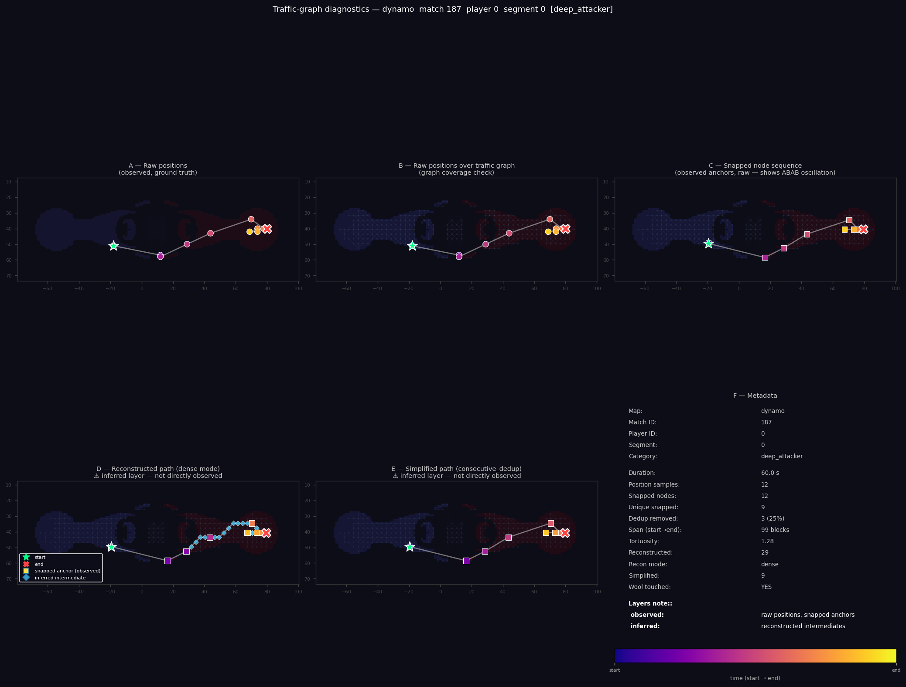

In all three wool-capture cases:
- Panel D (reconstructed path) follows established bridge corridors — no
  void-crossing shortcuts even for lives with only 9–22 unique position samples.
- The wool marker (`×`) lands on or adjacent to the closest graph node to the
  actual wool location.
- Bresenham filtering eliminated all cross-void phantom transitions, confirmed
  by visual inspection.
