# Island Shape Classifier

## What is this?

Every island in a CTW map has a *shape profile* — a label that describes its overall geometric form. This helps downstream analysis understand which maps have similar island designs, how layout affects gameplay, and which shapes are common or rare across the full map pool.

The classifier runs automatically after the island pipeline and assigns each unique canonical island shape one of thirteen labels: **square**, **rectangle**, **circle**, **donut**, **L_shape**, **Z_shape**, **T_shape**, **shard**, **plus**, **fork**, **rugged**, **linear**, or **blob**.

Example images for each category can be regenerated with:
```
python ctw.py debug profile-mosaic --examples
```

---

## How classification works

The classifier is a **rule cascade**: rules are tested in a fixed priority order and the first rule that matches determines the label. Once a shape is caught by an earlier rule, later rules are never evaluated.

This means rule ordering matters. Rules for clean, well-defined shapes (square, rectangle, circle) come first because they have tight conditions. The final rule — *blob* — is the catch-all for anything that didn't match anything earlier.

Most rules use features derived purely from the polygon geometry (bounding box, area, perimeter, convexity). A handful of later rules also use the skeleton graph — a one-pixel-wide medial axis computed from the island's block set — to count branches and junctions.

**Feature glossary**:

| Feature | Lay meaning |
|---------|-------------|
| `bbox_fill_ratio` | What fraction of the enclosing rectangle is actually filled — 1.0 = solid rectangle |
| `aspect_ratio` | How elongated the shape is — 1.0 = square bounding box, 2.0 = twice as long as wide |
| `convexity` | How convex the outline is — 1.0 = fully convex (no dents), lower = more concave or spiky |
| `rugosity` | How much the perimeter exceeds the bounding-box perimeter — 1.0 = smooth rectangle, higher = jagged edges |
| `compactness` | How circle-like the area-to-perimeter ratio is — 1.0 = perfect circle |
| `bbox_cutout_count` | Number of near-perfect rectangular corner cuts detected |
| `bbox_cutout_coverage` | What fraction of all negative space is accounted for by those corner cuts |
| `skeleton_topology` | Topology of the medial-axis skeleton: *line* (two endpoints, no junctions), *tree* (branching), *mesh* (loops), *none* |
| `skeleton_junction_count` | Number of branching points in the skeleton |
| `skeleton_endpoint_count` | Number of dead-end tips in the skeleton |

---

## Shape categories

Categories are listed in classification priority order. Each section includes up to five diverse examples drawn from the full island pool, sorted from most to least characteristic for the primary metric of that type. Shapes confirmed to classify correctly across the full dataset are marked ✓; categories with known weaknesses are noted.

---

### Square ✓

**What it looks like**: A filled-in block of land where all four sides are exactly equal length.

**Rule**: `bbox_fill_ratio == 1.0` AND `bbox_width == bbox_height`

Both conditions must be exact (floating-point equality on rounded values). The equal-sides check ensures e.g. a 10×11 island is a rectangle, not a square.

**Key features**: `bbox_fill_ratio`, `bbox_width`, `bbox_height`

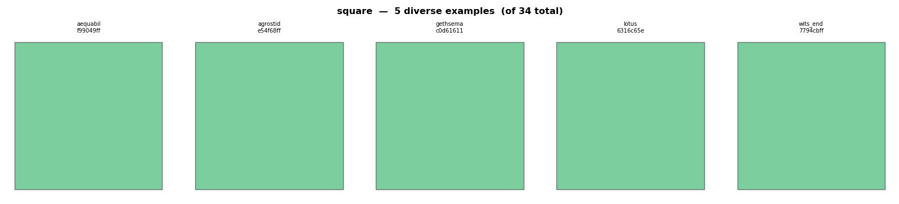

*Left to right: aequabilis (17×17, 289 blocks), agrostid (12×12, 144 blocks), gethsemane (11×11, 121 blocks), lotus (9×9, 81 blocks), wits_end (4×4, 16 blocks). All five are mechanically identical in feature space — a perfect square is a perfect square regardless of size.*

---

### Rectangle ✓

**What it looks like**: A filled rectangular block, longer in one direction than the other. Also includes near-perfect rectangles (slightly rounded WorldEdit shapes) and rectangles with small chamfered (clipped) corners.

**Rule** (three sub-cases, tested in order):
1. *Chamfered*: `bbox_cutout_count == 4` AND all four corners cut AND `bbox_cutout_coverage >= 0.99` AND `bbox_cutout_min_side_coverage >= 0.60`
2. *Perfect fill*: `bbox_fill_ratio == 1.0`
3. *Near-perfect*: `bbox_fill_ratio >= 0.95` AND `convexity >= 0.95` AND `hole_count == 0` AND no corner cutouts detected

**Key features**: `bbox_fill_ratio`, `convexity`, `bbox_cutout_count`

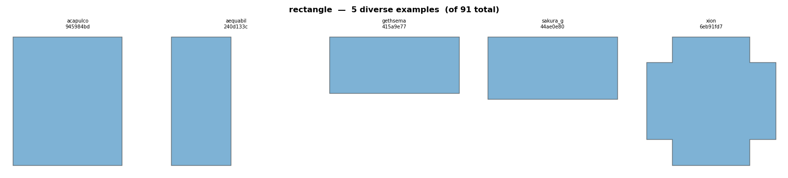

*Left to right: acapulco (fill=1.000, ar=1.19, 304 blocks), aequabilis (fill=1.000, ar=2.18, 629 blocks), gethsemane (fill=1.000, ar=2.27, 275 blocks), sakura_garden (fill=1.000, ar=2.06, 528 blocks), xion (fill=0.840, ar=1.00, 21 blocks — near-perfect sub-case, captured by Rule 2.5 rather than the exact-fill rule). The first four are perfect-fill rectangles spanning a range of aspect ratios; the last illustrates the slightly relaxed near-perfect threshold.*

---

### Circle ✓

**What it looks like**: A round or oval island — Minecraft "circles" are staircase approximations of discs, so they look like rounded, slightly faceted blobs rather than perfect geometric circles.

**Rule**: `convexity >= 0.88` AND `hole_count == 0` AND `has_point_symmetry` AND one of:
- *Near-square* (aspect ≤ 1.2): `circle_fit_residual < 0.12`
- *Elongated* (aspect > 1.2): `ellipse_residual < 0.10` AND `bbox_fill_ratio >= 0.72`

`has_point_symmetry` checks that the block set maps to itself under 180° rotation about the bounding-box midpoint. This gate rejects many near-round but asymmetric shapes that would otherwise pass on residual alone.

**Key features**: `convexity`, `circle_fit_residual`, `ellipse_residual`, `bbox_fill_ratio`, `has_point_symmetry`

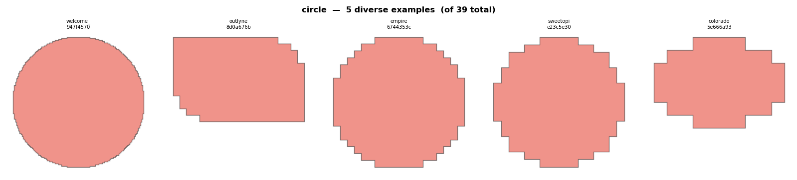

*Left to right: welcome_to_wool_square (fill=0.797, conv=0.987, ar=1.00, 11 285 blocks — large staircase disc), outlyne (fill=0.939, conv=0.980, ar=1.54, 244 blocks), empire (fill=0.812, conv=0.954, ar=1.00, 293 blocks), sweetopia (fill=0.778, conv=0.934, ar=1.00, 225 blocks), colorado (fill=0.771, conv=0.900, ar=1.43, 54 blocks — small circle at the bottom of the convexity range). The selection spans four orders of magnitude in area and both the near-square (ar ≤ 1.2) and elongated (ar > 1.2) sub-paths.*

---

### Donut ✓

**What it looks like**: A ring-shaped island with a hollow centre — the Minecraft equivalent of a torus or annulus.

**Rule**: `hole_count == 1` AND `convexity >= 0.92` AND `rugosity <= 1.1`

Exactly one interior void (the hole in the ring). The convexity and rugosity gates ensure the outer boundary is smooth — any jagged or branchy island can accidentally enclose a small gap without being a genuine ring.

**Key features**: `hole_count`, `convexity`, `rugosity`

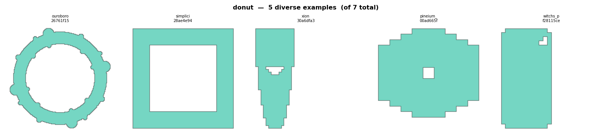

*Left to right: ouroboros (fill=0.338, conv=0.944, ar=1.00, 10 126 blocks — thin ring, only 34% of bbox filled), simplicity_ctw (fill=0.556, conv=1.000, ar=1.00, 20 blocks — tiny 4-block ring, convexity = 1.0 exactly), xion (fill=0.793, conv=0.952, ar=2.60, 464 blocks — elongated oval ring), pineium_ctw (fill=0.819, conv=0.952, ar=1.12, 236 blocks), witchs_potions (fill=0.976, conv=0.993, ar=2.00, 281 blocks — thick-walled ring that barely looks hollow). The range shows how fill ratio varies dramatically based on wall thickness.*

---

### L_shape ✓

**What it looks like**: A rectangle with one rectangular corner removed — looks like the letter L or any 90° rotation thereof.

**Rule**: `bbox_cutout_count == 1` AND `bbox_cutout_coverage >= 0.90`

The coverage gate ensures the single corner cut accounts for ≥ 90% of all negative space inside the bounding box. Each cut must itself be ≥ 95% filled as a rectangle — only clean rectangular notches qualify, not curved or ragged bites.

**Key features**: `bbox_cutout_count`, `bbox_cutout_coverage`

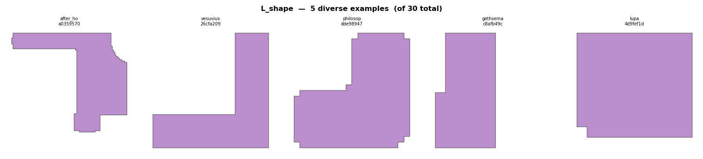

*Left to right: after_hours (fill=0.454, ar=1.16, 3 460 blocks — large cutout, nearly half the bbox removed), vesuvius (fill=0.494, ar=1.00, 1 001 blocks), philosophers_stone (fill=0.735, ar=1.00, 294 blocks), gethsemane (fill=0.913, ar=1.92, 252 blocks), lupa (fill=0.991, ar=1.10, 109 blocks — single-block corner cut at the limit of detection). Fill ratio ranges from 0.45 to 0.99 — the only constant is one clean rectangular notch.*

---

### Z_shape ✓

**What it looks like**: A rectangle with two rectangular corner cuts at *diagonally opposite* corners — the Z shape (or its mirror image, the S shape).

**Rule**: `bbox_cutout_count == 2` AND `bbox_cutout_coverage >= 0.90` AND corners are TL+BR or TR+BL (diagonal pair)

**Key features**: `bbox_cutout_count`, `bbox_cutout_coverage`, `bbox_cutout_corners`

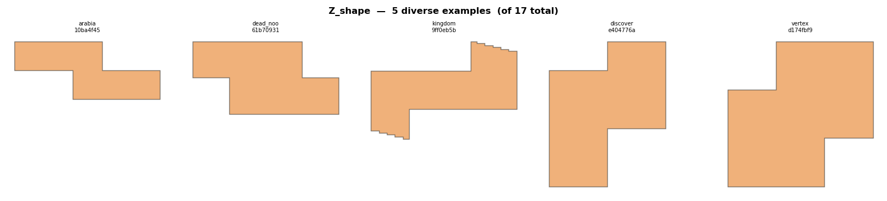

*Left to right: arabia (fill=0.600, ar=2.50, 864 blocks — classic elongated Z with large corner cuts), dead_noon (fill=0.750, ar=2.00, 864 blocks), kingdom (fill=0.536, ar=1.49, 1 917 blocks — very deep cuts), discovery (fill=0.700, ar=1.25, 224 blocks), vertex (fill=0.778, ar=1.00, 112 blocks — nearly-square Z with small cuts). Aspect ratio ranges from 1.00 to 2.50.*

---

### T_shape ✓

**What it looks like**: A rectangle with two rectangular corner cuts on the *same side* — the two cuts together create a protruding central stem, like the letter T or any of its 90° rotations.

**Rule**: `bbox_cutout_count == 2` AND `bbox_cutout_coverage >= 0.90` AND corners are an adjacent pair: TL+TR, BL+BR, TL+BL, or TR+BR

**Key features**: `bbox_cutout_count`, `bbox_cutout_coverage`, `bbox_cutout_corners`

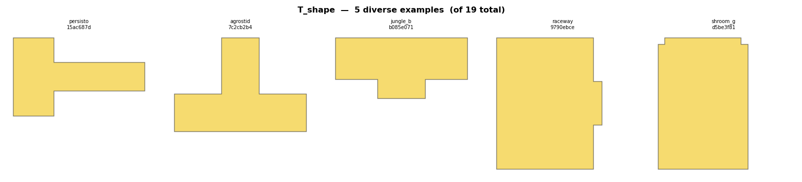

*Left to right: persisto (fill=0.558, conv=0.716, ar=1.68, 586 blocks — deep cuts, strongly concave), agrostid (fill=0.571, conv=0.727, ar=1.40, 720 blocks), jungle_beat (fill=0.800, conv=0.889, ar=2.16, 623 blocks), raceway (fill=0.944, conv=0.971, ar=1.25, 170 blocks), shroom_galaxy (fill=0.992, conv=0.996, ar=1.46, 245 blocks — tiny corner cuts, barely reads as a T). Fill ratio climbs from 0.56 to 0.99 across the range.*

---

### Shard

**What it looks like**: A pointed, elongated shape — a diamond, rhombus, lens, or teardrop. The archetype is a Minecraft staircase diamond, but any shape with a smooth outline and two tapered endpoints qualifies.

**Rule**: `skeleton_topology == 'line'` AND `convexity >= 0.87` AND:
- *Near-square* (aspect ≤ 1.2): `circle_fit_residual >= 0.12`
- *Elongated* (aspect > 1.2): `ellipse_residual >= 0.10` OR `bbox_fill_ratio < 0.72`

This is the logical complement of the circle rule at the same convexity level: a shape that looks smooth but doesn't fit a circle or ellipse well is a shard. It also requires the skeleton to have line topology (exactly two endpoint tips, no junctions).

**Key features**: `skeleton_topology`, `convexity`, `circle_fit_residual`, `ellipse_residual`

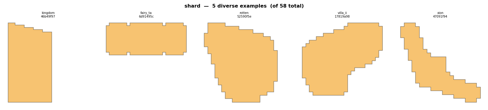

*Left to right: kingdom (fill=0.940, conv=0.987, ar=1.84, 625 blocks — elongated lens shape), fairy_tales_metamorphose (fill=0.973, conv=0.980, ar=2.45, 289 blocks — elongated at high aspect ratio), rotten (fill=0.754, conv=0.933, ar=1.10, 364 blocks), villa_ii (fill=0.696, conv=0.906, ar=1.10, 336 blocks), xion (fill=0.365, conv=0.722, ar=1.00, 161 blocks — manual override; convexity 0.722 is below the automatic threshold of 0.87). Convexity drops from 0.99 to 0.72 across the range.*

**Known weaknesses**: The shard rule requires `skeleton_topology == 'line'`. Blockiness or slight irregularity in a shard's outline can introduce spurious skeleton branches, pushing the shape to fork or blob instead. Some confirmed shards in the dataset (e.g. the rightmost example) are manual overrides outside the automatic rule bounds.

---

### Plus

**What it looks like**: A plus sign (+) or cross — four arms radiating from a central junction, evenly distributed around the centre.

**Rule**: `skeleton_topology == 'tree'` AND `skeleton_junction_count == 1` AND `skeleton_endpoint_count == 4` AND `skeleton_min_arm_angle >= 60.0°`

The minimum arm angle check ensures the four arms are spread around the centre (a true plus has ~90° gaps between arms). Shapes where several arms cluster on one side have a minimum gap below 60° and are excluded.

**Key features**: `skeleton_junction_count`, `skeleton_endpoint_count`, `skeleton_min_arm_angle`

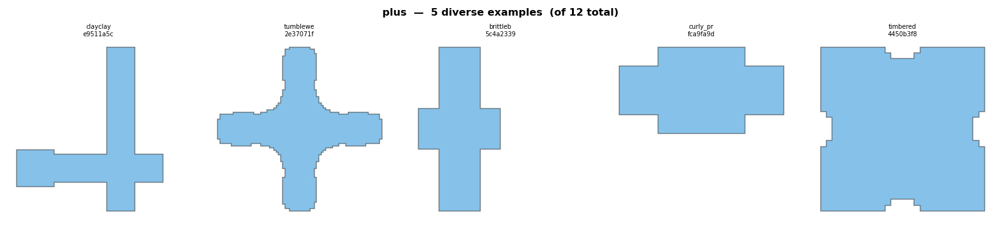

*Left to right: clayclay (fill=0.347, conv=0.508, ar=1.12, 1 745 blocks — thin arms, strongly concave), tumbleweed (fill=0.366, conv=0.574, ar=1.00, 1 953 blocks), brittlebush (fill=0.625, conv=0.769, ar=2.00, 500 blocks — elongated cross), curly_pride (fill=0.791, conv=0.883, ar=1.89, 121 blocks), timbered (fill=0.949, conv=0.949, ar=1.00, 744 blocks — very thick arms, barely distinguishable from a rounded square). Fill ratio spans 0.35 to 0.95.*

**Known weaknesses**: The rule relies entirely on skeleton node counts. Very thick-armed plus shapes (high fill, high convexity — see rightmost example) pass the test even though they look closer to a rounded square with four corner indentations than a traditional plus sign. Conversely, a true plus whose skeleton picks up extra noise junctions will be mis-classified as fork.

---

### Fork

**What it looks like**: A complex, highly branching shape — multiple junctions (branching points) in the skeleton and strongly concave outline. Think of a Y or T with sub-branches, a starfish, or any island with deep inlets and irregular arms. Some fork-classified islands also enclose internal holes (fully surrounded voids), making them structurally more complex than the junction count alone suggests.

**Rule**: `skeleton_junction_count >= 2` AND `convexity < 0.70`

**Key features**: `skeleton_junction_count`, `convexity`, `hole_count`

Examples are selected by a compound score (hole_count × 5 + junction_count) so that islands with the most structural complexity — both holes and junctions — appear first.

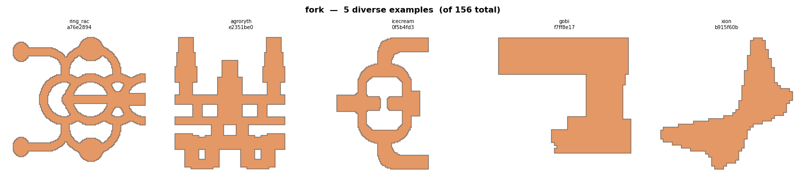

*Left to right: ring_race (fill=0.386, conv=0.635, ar=1.06, 7 236 blocks — 7 enclosed holes, strongly forked), agrorythe (fill=0.570, conv=0.627, ar=1.20, 10 530 blocks — 5 holes), icecream_sandwiched_ii (fill=0.391, conv=0.664, ar=1.44, 3 972 blocks — 1 hole), gobi (fill=0.589, conv=0.693, ar=1.14, 1 296 blocks — 0 holes, high junctions only), xion (fill=0.321, conv=0.586, ar=1.00, 621 blocks — simplest fork, no holes, few junctions). The hole count range (7 → 0) shows that fork covers both ring-like complex arenas and simple T-junction landmasses.*

**Known weaknesses**: Fork covers an enormous range — from deeply forked islands (conv≈0.33) to shapes that are only mildly concave (conv≈0.70). The convexity < 0.70 threshold is an empirical boundary with no principled derivation; shapes near 0.68–0.72 are ambiguous between fork, rugged, and blob. Because fork is tested *before* rugged, any shape with ≥ 2 skeleton junctions and low enough convexity is fork, regardless of how jagged its perimeter is.

---

### Rugged

**What it looks like**: An island with a highly irregular, jagged perimeter — lots of bumps and indentations, but without the deep concave branches that would make it a fork.

**Rule**: `rugosity >= 1.2`

Rugosity is the ratio of the actual perimeter to the perimeter of the bounding box. A smooth rectangle has rugosity = 1.0; a coastline-like edge pushes it above 1.2.

**Key features**: `rugosity`

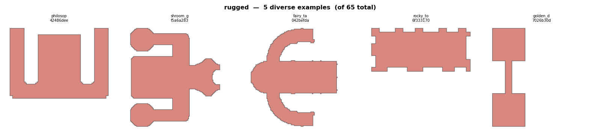

*Left to right: philosophers_stone (fill=0.733, conv=0.734, ar=1.40, 3 106 blocks), shroom_galaxy (fill=0.610, conv=0.748, ar=1.10, 9 204 blocks — huge bumpy landmass), fairy_tales_metamorphose (fill=0.479, conv=0.661, ar=1.14, 6 146 blocks), rocky_top (fill=0.858, conv=0.860, ar=2.27, 236 blocks — elongated with jagged edges), golden_drought_iii (fill=0.733, conv=0.733, ar=3.00, 220 blocks — very elongated, borderline linear). Area ranges from 220 to 9 204 blocks.*

**Known weaknesses**: Rugged fires *before* linear in the cascade, so an elongated jagged shape (aspect ≥ 2.5 with high rugosity) is always classified as rugged rather than linear. The rightmost example has aspect_ratio = 3.00 and might reasonably be called linear. There is no upper bound on rugosity, so a shape that is extremely jagged and deeply concave can still be rugged if it somehow escapes the fork rule (e.g. if its skeleton has only 1 junction).

---

### Linear

**What it looks like**: A strongly elongated island — a long thin strip, bridge, or corridor.

**Rule**: `aspect_ratio >= 2.5`

**Key features**: `aspect_ratio`

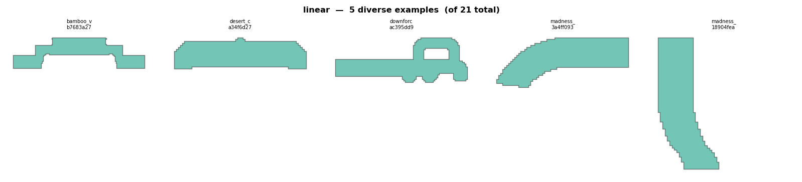

*Left to right: bamboo_valley_v (fill=0.491, ar=4.28, 2 722 blocks), desert_country (fill=0.809, ar=4.19, 867 blocks), downforce (fill=0.518, ar=2.93, 1 276 blocks), madness_on_rails (fill=0.586, ar=2.64, 966 blocks), madness_on_rails (fill=0.577, ar=2.15, 840 blocks — manual override; ar=2.15 is below the 2.5 threshold). The last example shows that visually linear shapes just below the cut-off fall through to blob without the override.*

**Known weaknesses**: The linear rule has a single threshold and no other constraints. A very elongated but heavily branched shape would be caught by fork first (if convexity < 0.70) or by rugged (if rugosity ≥ 1.2), so linear only fires for smooth, elongated shapes that escaped all earlier rules. The 2.5 threshold leaves a meaningful gap — shapes in the 2.0–2.4 range that look obviously linear end up as blob.

---

### Blob

**What it looks like**: Everything else — irregular shapes that don't fit any of the defined categories above. Blobs include large landmasses with organic coastlines, near-square shapes that are too round to be rectangles but too irregular to be circles, and any shape the classifier couldn't confidently categorize.

**Rule**: Default — matches anything that did not satisfy any earlier rule.

**Key features**: (none — this is the catch-all)

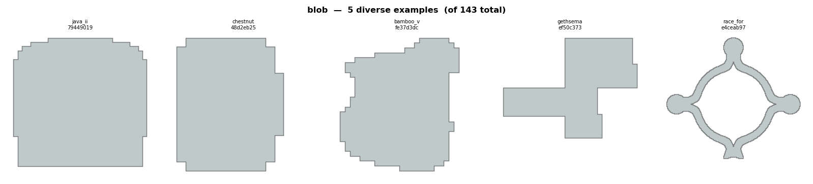

*Left to right: java_ii (fill=0.951, conv=0.982, ar=1.03, 884 blocks — nearly rectangular, just below all rectangle thresholds), chestnut (fill=0.933, conv=0.971, ar=1.25, 168 blocks), bamboo_valley_v (fill=0.773, conv=0.896, ar=1.12, 501 blocks), gethsemane (fill=0.522, conv=0.682, ar=1.33, 1 466 blocks), race_for_victory_3 (fill=0.190, conv=0.717, ar=1.10, 6 690 blocks — huge sparse landmass, only 19% of bbox filled). Fill ranges from 0.95 to 0.19 — blob is genuinely heterogeneous.*

**Known weaknesses**: Blob is a catch-all that spans an enormous range — from near-rectangles (fill≈0.95) to huge sparse organic landmasses (fill≈0.19). The leftmost example is a visually clean, nearly-solid island that "fell through" every rule without matching. Splitting blob into sub-types (e.g. "dense near-rectangle" and "sparse organic") would give more actionable signal for layout analysis.

---

## Classification statistics (2026-04-13)

Across 217 maps, 710 canonical island shapes:

| Category  | Count | %     |
|-----------|-------|-------|
| fork      | 156   | 22.0% |
| blob      | 143   | 20.1% |
| rectangle | 91    | 12.8% |
| shard     | 58    | 8.2%  |
| rugged    | 65    | 9.2%  |
| circle    | 39    | 5.5%  |
| square    | 34    | 4.8%  |
| L_shape   | 30    | 4.2%  |
| linear    | 21    | 3.0%  |
| T_shape   | 19    | 2.7%  |
| Z_shape   | 17    | 2.4%  |
| plus      | 12    | 1.7%  |
| donut     | 7     | 1.0%  |

Fork and blob together account for 42% of all shapes. This is partly by design (they are catch-alls) but also reflects genuine diversity in the map pool.

---

## Summary of known classifier weaknesses

| Category | Known issue |
|----------|-------------|
| **shard** | Requires `skeleton_topology == 'line'`; blockiness can produce spurious junctions pushing shard-shaped islands to fork or blob. Some confirmed shards in the dataset are manual overrides below the convexity threshold (0.87). |
| **plus** | Relies entirely on skeleton node counts. Very thick-armed plus shapes (high fill, high convexity) pass the test even though they look more like rounded squares with indentations than a classic plus sign. |
| **rugged vs linear** | Rugged fires before linear in the cascade; a long, jagged island is always rugged, never linear. May warrant a reordering or a combined "rugged-linear" type. |
| **fork threshold** | The convexity < 0.70 boundary is empirical. Shapes near 0.68–0.72 are ambiguous between fork, rugged, and blob. |
| **blob density range** | Blob spans everything from near-rectangles (fill ≈ 0.95) to huge sparse organic landmasses (fill ≈ 0.19). Splitting blob into sub-types would improve analysis granularity. |
| **linear threshold** | The ar ≥ 2.5 threshold leaves visually linear shapes in the 2.0–2.4 range falling into blob. |
| **donut strict hole_count** | Only `hole_count == 1` qualifies. A ring whose blocks don't fully enclose the interior void may generate multiple small separate air pockets (hole_count > 1) and escape classification as donut. |
