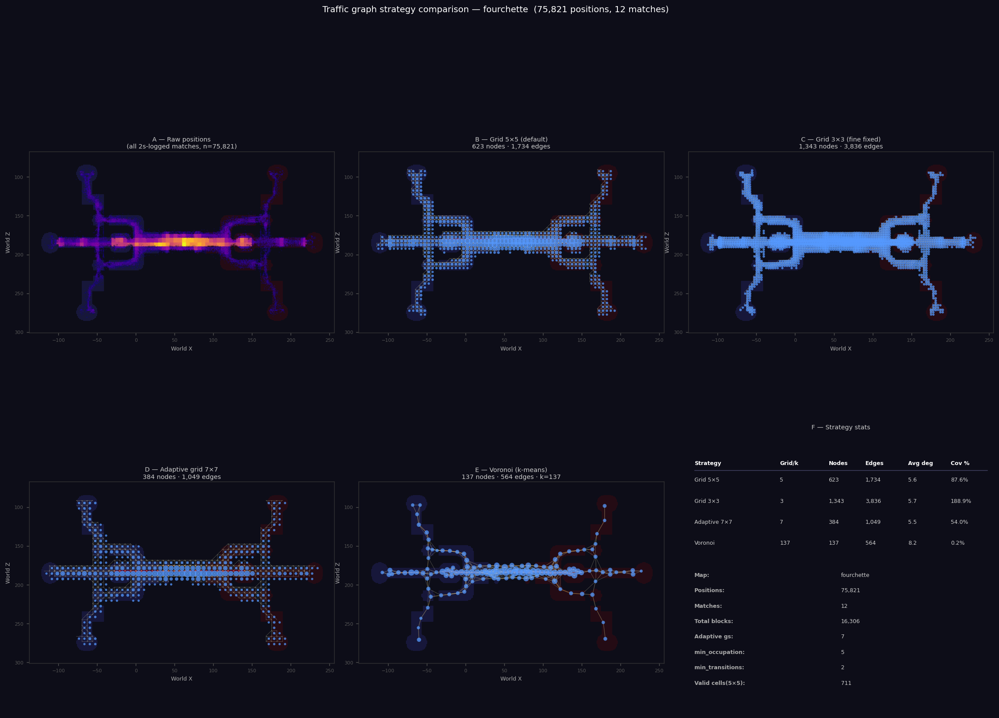
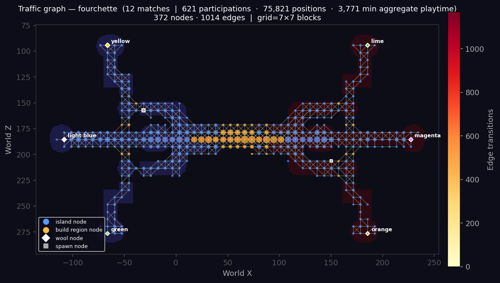
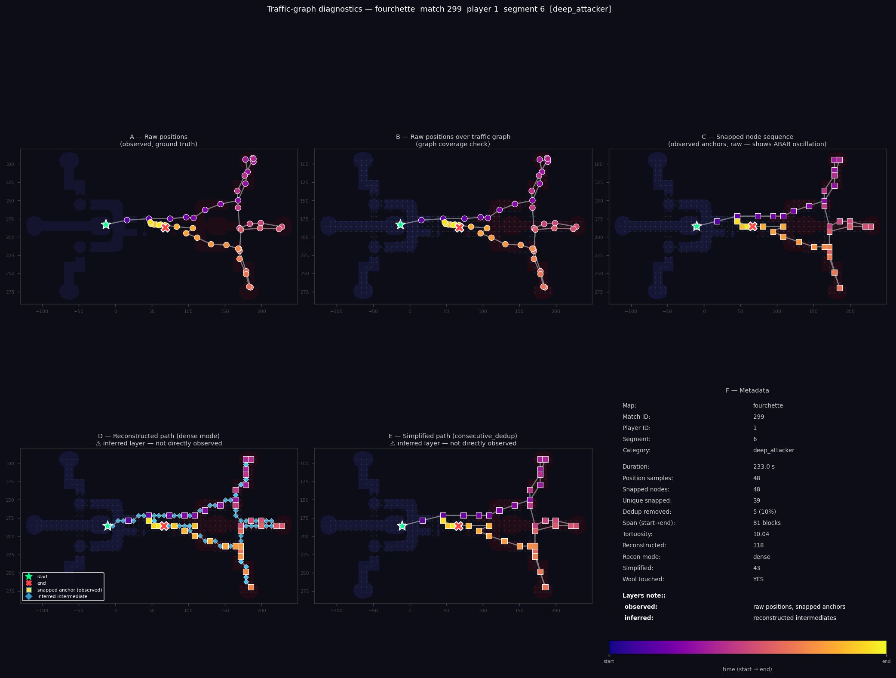

# Traffic Graph

**Date:** 2026-03-11
**Updated:** 2026-03-12

---

## Overview

The traffic graph is a data-driven spatial graph built from player position samples.
It represents the movement network of a CTW map — which areas players actually use,
how they connect islands, and how frequently each corridor is traversed.
The graph is the backbone for life-segment analysis: it provides the coordinate
space in which a player's sparse position samples can be snapped to a topology,
interpolated into a coherent path, and scored against heuristic metrics to
classify play style.

This document covers the construction pipeline, a six-map validation across a
wide range of map sizes and shapes, and a summary of what the graph enables for
player role analysis.

---

## Background: Position Logging Rates

CTW match logs are produced at two sampling intervals depending on server
configuration:

| Interval | Matches | Share |
|----------|---------|-------|
| 2 s      | 1 730   | 70.6% |
| 5 s      |   719   | 29.3% |
| unknown  |     3   |  0.1% |

At 2 s sampling, the median inter-sample displacement is ~5 blocks (p90 = 12.5).
At 5 s, the median rises to ~8 blocks (p90 = 27). Mixing the two rates would
require a much larger grid cell to remain stable and would produce graphs that
misrepresent typical movement granularity.

Graph construction uses only 2 s-logged matches by default (`--log-interval 2`).
The 5 s corpus is excluded until a dedicated coarser graph is needed.
Each match's logging rate is stored in `matches.log_interval` (computed from the
median inter-sample gap at ingestion time).

---

## Graph Construction

### Input filtering

The raw input is the `position_events` table, with two hard filters applied before
any graph logic runs:

- **`y > 0`** — discards positions below the world floor. Players who fall into
  the void produce samples at `y = 0` or below; these would otherwise create
  nodes in non-playable space.
- **`log_interval = 2`** — restricts to matches at the standard 2 s sampling rate,
  keeping edge lengths consistent across the corpus.

### Grid quantisation

Each surviving position `(x, z)` is quantised to a grid cell of side `grid_size`
blocks. The cell coordinate is `(floor(x / grid_size) * grid_size,
floor(z / grid_size) * grid_size)`. Every cell that contains at least one sample
becomes a **node** in the graph. Nodes inherit coordinates from the centroid of
their samples.

### Adaptive grid size

Rather than a fixed cell size, `grid_size` is derived from the total number of
playable blocks on the map:

```
grid_size = max(2, round(sqrt(total_blocks / 300)))
```

This formula keeps node counts in a stable range — roughly 270–460 nodes —
regardless of whether the map spans 1 500 or 20 000 blocks. A fixed 5-block grid
would produce ~59 nodes on a tiny map and ~880 on a large one, making
cross-map comparisons meaningless.

| Map           | Blocks | Grid | Nodes | Edges |
|---------------|--------|------|-------|-------|
| dromedary     |  1 466 |  2   |   457 | 1 355 |
| expedition    |  2 300 |  3   |   302 |   839 |
| research_base |  2 808 |  3   |   326 |   906 |
| dynamo        |  2 957 |  3   |   270 |   754 |
| fourchette    | 16 306 |  7   |   372 | 1 014 |
| level_up      | 20 288 |  8   |   374 | 1 234 |

### Edge construction and Bresenham validation

An **edge** is a directed pair of nodes `(A → B)` observed when the same player's
consecutive position samples fall in two different grid cells. Each such hop
increments the transition count for that edge.

The critical quality step is **void-edge rejection**. When a player crosses a gap
(bridge, void, water) between two islands, their position samples may jump directly
from cell A to cell B even though the straight line between them passes through
empty space. Accepting these transitions naively produces "flying" edges that make
the graph topologically wrong — the graph claims you can walk between two distant
points when in reality there is no path.

To reject these, we apply **Bresenham's line algorithm** between cell A and cell B.
Every intermediate cell along the rasterised line is checked against a
`valid_cell_set` — the set of cells that contain at least one player sample with
`y > 0`. If any intermediate cell is absent from this set, the entire transition
is rejected. The result is a graph where every edge follows a corridor that
players have actually occupied.

This is fully data-driven: no manual map geometry, no build-region XML, no
explicit bridge coordinates — only the player data itself defines what is
reachable.

### Island coloring

Each node is associated with the island polygon it falls within (read from
`map_context.json`). Islands are colored by team using spawn-position-anchored
assignment: the split axis and side→team mapping are determined by comparing
actual spawn coordinates, so maps with unusual geometry (e.g. where spawns are
not on a detected island) are handled correctly.

---

## Validation Maps

Six maps were chosen to cover a wide range of sizes, shapes, and wool counts:

| Map           | Blocks | Dimensions | Islands | Wools/team | Shape                        | Matches (2s) |
|---------------|--------|------------|---------|------------|------------------------------|--------------|
| dromedary     |  1 466 |  97×97     |      10 |      1     | Tiny, many small islands     |           34 |
| expedition    |  2 300 | 104×128    |       7 |      1     | Medium, elongated corridor   |           37 |
| research_base |  2 808 |  54×164    |       8 |      1     | Medium, compact cluster      |           22 |
| dynamo        |  2 957 | 171×37     |       9 |      1     | Medium, extremely narrow     |           31 |
| fourchette    | 16 306 | 363×201    |      12 |      3     | Large, wide multi-wool       |           12 |
| level_up      | 20 288 | 228×332    |       5 |      1     | Large, 4-tier bridge         |            6 |

---

## Strategy Comparison

The `--compare` flag generates a 6-panel diagnostic showing four grid strategies
(raw scatter, Grid-5, Grid-3, adaptive) plus a Voronoi/k-means alternative and a
statistics summary. This is primarily used to sanity-check the adaptive formula
and the Bresenham filter on new maps.

### Dromedary (1 466 blocks, grid 2)


Dense, closely-spaced islands require a small cell to separate them correctly.
Adaptive 2-block grid produces ~457 nodes with clean island boundaries.
Grid-5 merges several adjacent small islands into single nodes.

### Expedition (2 300 blocks, grid 3)


The elongated single-corridor layout suits a 3-block grid well. Grid-5 begins to
merge the narrow bridge lanes. Voronoi centres align naturally along the corridor
axis.

### Research Base (2 808 blocks, grid 3)


Compact island cluster. Adaptive 3-block grid gives good island separation with
326 nodes. Grid-5 is acceptable but loses detail in the densely built central
areas.

### Dynamo (2 957 blocks, grid 3)


The extreme aspect ratio (171×37) is handled correctly by the adaptive grid —
the narrow axis retains enough nodes to represent bridges. Voronoi centroids fall
into void in several places due to the asymmetric shape, making it less reliable
here.

### Fourchette (16 306 blocks, grid 7)



The widest map in the validation set (363 blocks across) with three wools per
team. The adaptive 7-block grid produces 372 nodes at a density that still
distinguishes the six per-team wool islands from the four central islands.
Grid-5 overshoots to ~550 nodes on this size; Grid-3 would approach 1 500.
Voronoi with 90 clusters is competitive here — the large open areas between
islands allow k-means to find meaningful centroids without falling into void.
The strategy comparison also confirms the Bresenham filter is working: the
wide void gaps between the lateral wool islands do not produce crossing edges.



### Level Up (20 288 blocks, grid 8)


The 4-tier vertical bridge map benefits from a coarse 8-block grid: 374 nodes
captures each tier without redundancy. Grid-5 at 879 nodes is expensive and
noisy. Voronoi is a viable alternative for a very compact summary.

---

## Life-Segment Diagnostic Validation

Running `scripts/run_traffic_diagnostics.py` (or `ctw debug prepare-demo`) for
each map selects eight representative life segments per category, snaps their
positions to the graph, reconstructs dense paths via Dijkstra, and produces a
6-panel figure:

- **A** — Raw positions (ground truth)
- **B** — Raw positions overlaid on graph nodes
- **C** — Snapped node sequence (shows ABAB oscillation)
- **D** — Reconstructed path (Dijkstra-interpolated intermediates)
- **E** — Simplified path (consecutive dedup)
- **F** — Metadata (duration, positions, wool touch, kills, etc.)

### Deep-attacker segments (wool capture validation)

| Map           | Wool touched | Duration | Positions | Unique nodes | Span    |
|---------------|-------------|----------|-----------|--------------|---------|
| dromedary     | **YES**     |   69 s   |    13     |       9      |  80 bl  |
| expedition    | no          |  109 s   |    20     |      17      |  31 bl  |
| research_base | **YES**     |  140 s   |    29     |      22      |  56 bl  |
| dynamo        | **YES**     |   60 s   |    12     |       9      |  99 bl  |
| fourchette    | **YES**     |  136 s   |    24     |      19      | 196 bl  |
| level_up      | no          |  237 s   |    43     |      17      |  89 bl  |

Four of six maps have confirmed wool-capture deep-attacker segments. In all four,
the reconstructed path follows island → bridge → enemy island topology with no
void-crossing shortcuts.

#### Dromedary


13 positions, 9 unique nodes, 80-block span. Path travels from home island
(bottom-left) across two bridge hops to the enemy wool area (top-right).

#### Research Base


29 positions, 22 unique nodes, 56-block span, tortuosity 5.90. The trajectory
spirals through the island cluster before terminating at enemy wool. Dijkstra
routing correctly threads the bridge corridors.

#### Dynamo


12 positions, 9 unique nodes, 99-block span — the full map width in 60 s.
With sparse samples on a narrow map, the graph reconstructs a coherent left-to-right
traversal through all intermediate bridge nodes.

#### Fourchette



24 positions, 19 unique nodes, 196-block span. Fourchette's wide layout means a
wool capture involves crossing nearly the full width of the map. The 7-block grid
is coarse enough to keep the path readable but fine enough to resolve each of
the three target wool islands individually. A distinctive property of multi-wool
maps is that the deep-attacker metric (minimum Dijkstra distance to an enemy wool
node) naturally separates players who reached *any* of the three enemy wools from
those who only probed the centre.

#### Expedition


Player reached min Dijkstra distance = 0 to enemy wool but did not touch it.
Path follows the corridor cleanly from one end to the other.

#### Level Up


The 4-tier vertical structure is visible in the raw scatter (panel A). The snapped
path descends from the upper spawn tier down the bridge staircase to the lower
enemy area.

### Traffic graph overviews

| | | |
|---|---|---|
|  |  |  |
| Dromedary (grid 2) | Expedition (grid 3) | Research Base (grid 3) |
|  |  |  |
| Dynamo (grid 3) | Fourchette (grid 7) | Level Up (grid 8) |

---

## Cross-Map Findings

### Void-edge elimination holds universally

In all six maps, Bresenham validation eliminates every inter-island "flying" edge.
Panel D (reconstructed path) consistently shows players routing through bridge
corridors rather than cutting across void. This is particularly clear on dynamo
(a 37-block-wide corridor with bridges just 3–4 blocks across) and fourchette
(where lateral wool islands are separated by 20–30 blocks of void).

### The adaptive grid formula is stable

The formula `max(2, round(sqrt(blocks / 300)))` keeps node counts in the 270–460
range across a 14× variation in map area. The consistency matters: downstream
heuristics like tortuosity and Dijkstra distances are expressed in graph hops,
so a wildly different node count would make cross-map comparisons meaningless.

### Sparse position data is sufficient for path reconstruction

The most data-sparse life in the validation set has 12 position samples over 60 s
(dynamo deep attacker). Even at that density, Dijkstra interpolation produces a
path that correctly traverses the full map. This is a strong validation that the
graph connectivity — built from the aggregate of all matches — compensates for
the low per-life sample rate.

### Graph topology reflects real play patterns

The edge weight distribution (transition counts) consistently shows the highest
traffic on the main bridge corridors connecting spawn to enemy territory. Dead-end
areas and wool rooms appear as low-degree nodes with high transition counts from
one specific direction — exactly the expected signature of wool attack/defense.
On fourchette, the three-wool structure creates three distinct high-traffic
corridors per side, visible as three separate bands of heavy edges in the overview.

### Multi-wool maps add metric resolution

With three enemy wool nodes, the `min_enemy_wool_dist` metric has more
discrimination power: a player who reached the far wool is clearly distinguished
from one who only reached the nearest wool, whereas on a single-wool map any
deep attacker gets the same minimum distance of 0. This is useful for identifying
specialisation within the attacker role.

---

## Role Classification: Current Heuristics and Next Steps

### Current heuristic selectors

The diagnostic pipeline selects one representative segment per category using
single-metric scores:

| Category      | Primary metric                                      |
|---------------|-----------------------------------------------------|
| deep_attacker | min Dijkstra distance to any enemy wool node        |
| defender      | mean Dijkstra distance to home wool nodes           |
| roamer        | tortuosity × log(unique\_nodes), span ≥ 40 bl       |
| traversal     | maximum first→last Euclidean span                   |
| high\_killer  | kill count in one life                              |
| skybridge     | fraction of samples at y ≥ 22                       |
| bow\_archer   | fraction of held-item samples identifying a bow     |
| builder       | fraction of held-item samples identifying a block   |

These work well for finding one clear example per category across the corpus.
They do not produce a complete, conflict-free classification: a high-killer who
also happens to have a large span would be assigned to high_killer only, ignoring
their traversal behaviour.

### Towards a classifier

The natural next step is a multi-feature classifier that assigns a *probability
distribution* over roles to every life segment rather than forcing a single
exclusive label. The feature set already available per segment is:

- `min_enemy_wool_dist`, `avg_home_wool_dist` — graph-distance-based position
- `unique_nodes`, `tortuosity`, `span_m` — movement character
- `kill_count`, `duration` — combat and time
- `frac_elevated`, `avg_y` — vertical positioning
- `frac_bow`, `frac_builder` — held-item behaviour

A logistic regression or gradient-boosted classifier trained on a set of
manually confirmed examples would generalise well because all features are
expressed in graph-relative terms (hops, ratios) rather than raw coordinates —
making cross-map generalisation feasible without retraining per map.

An intermediate step is **unsupervised clustering**: projecting all segments into
the feature space and running k-means (k ≈ 8–12) to find natural groupings. The
cluster centres can then be interpreted against the heuristic categories. On
fourchette, the high_killer segment (20 kills, tortuosity 49, span 30 blocks)
and the skybridge segment (98% elevated, span 190 blocks) are clearly separated
in any reasonable feature projection — these extreme examples are good anchors for
labelling a training set.

### Temporal dimension

All current metrics collapse a full life segment into a single score vector.
Finer-grained analysis could track how a player's graph position evolves
over time within one life: starting deep in home territory, advancing toward
the centre, retreating after a near-death. This temporal trajectory in graph
space could identify push-and-fall-back patterns that are invisible to
aggregate metrics.

---

## Usage

```bash
# Build / refresh traffic graph for a map (adaptive grid, 2 s matches only)
python ctw.py matches traffic-graph --map <slug>

# Force rebuild
python ctw.py matches traffic-graph --map <slug> --force

# Strategy comparison diagnostic (6-panel PNG)
python ctw.py matches traffic-graph --map <slug> --compare

# Full asset pipeline: builds graph, comparison, diagnostics, copies to docs/demo/assets/
python ctw.py debug prepare-demo --map <slug>
python ctw.py debug prepare-demo --map <slug> --force
```

**Default parameters:**
- `--log-interval 2` (2 s-logged matches only)
- `--grid-size auto` (`max(2, round(sqrt(blocks/300)))`)
- `--strategy grid` (Bresenham-filtered grid graph)

---

## Limitations

1. **5 s-logged matches excluded** — 29.4% of the corpus is unused. A coarser
   graph built from 5 s data could serve as a complementary view, but requires
   a larger grid (cell ≈ 10–15 blocks) to produce edges of comparable length.

2. **No temporal weighting** — all positions contribute equally regardless of
   match phase. A time-weighted graph could highlight strategic shifts between
   opening, mid-game, and late-game.

3. **Low match count on some maps** — level_up has 6 2s-matches; fourchette has
   12. Infrequently used paths may be absent from the graph. More matches improve
   coverage monotonically.

4. **Fixed Bresenham threshold** — intermediate cells must be in the valid cell
   set. On maps with unusual bridge geometry (e.g. very narrow 1-block bridges)
   some valid transitions may be rejected if the bridge cell never appears in the
   aggregate data. Lowering the grid size mitigates this.
