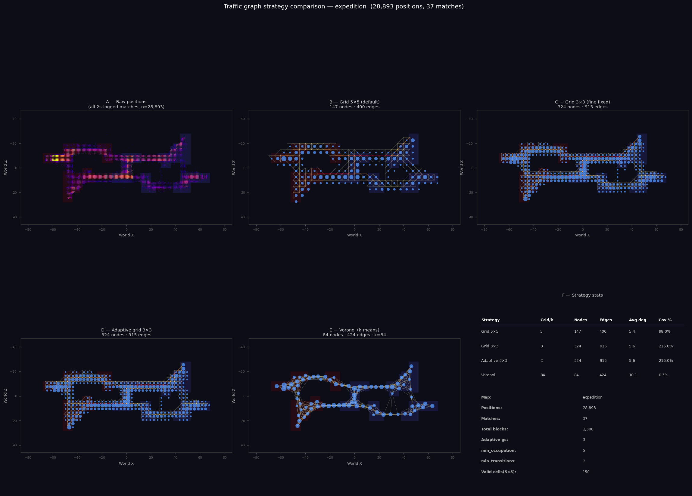
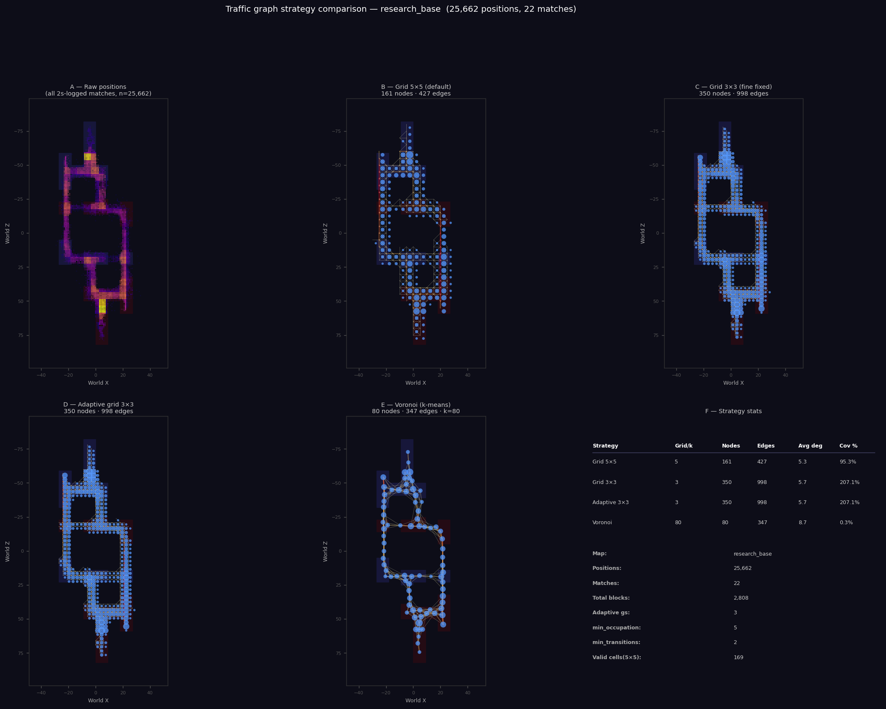
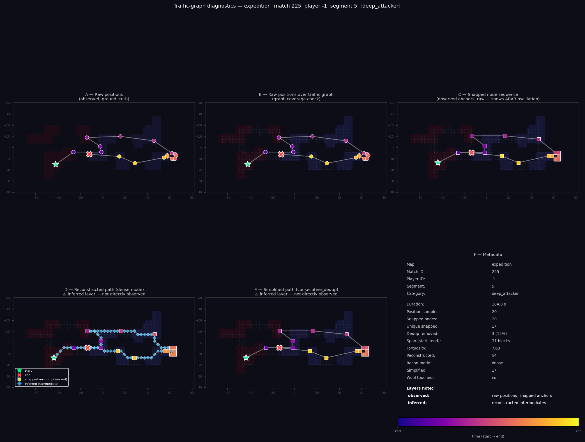
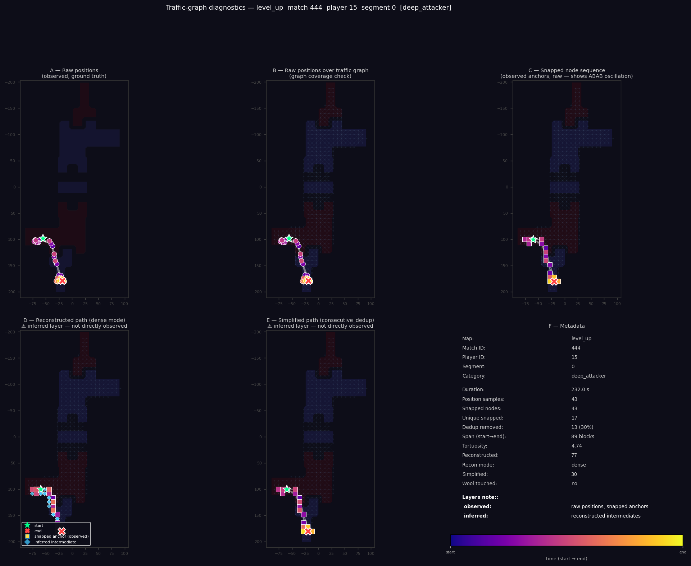
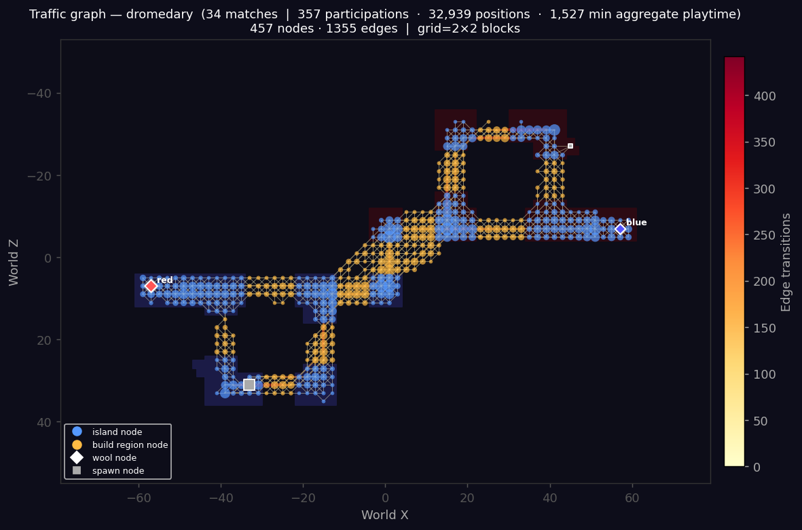
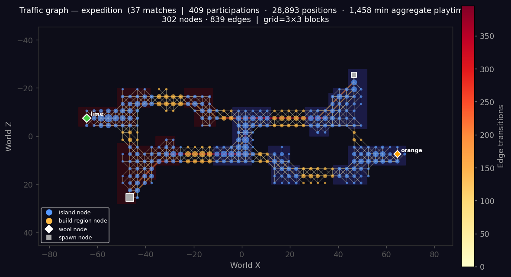
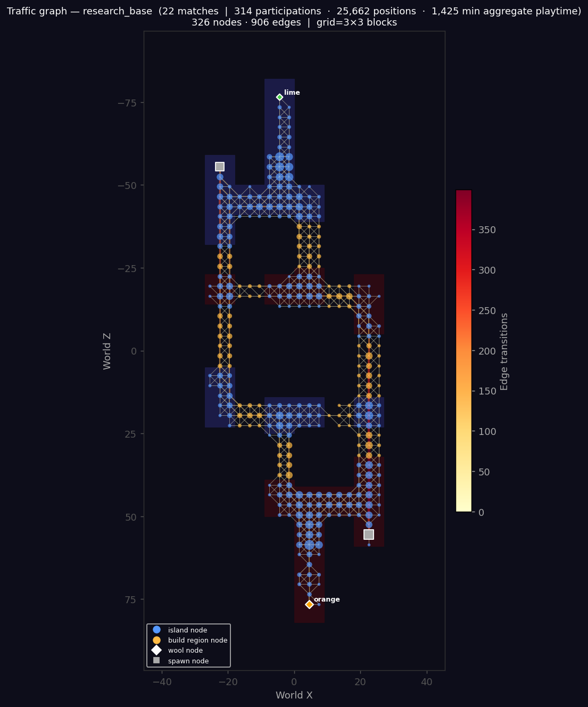
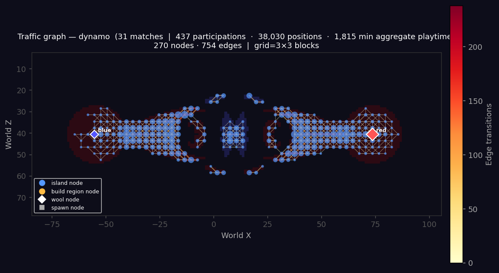
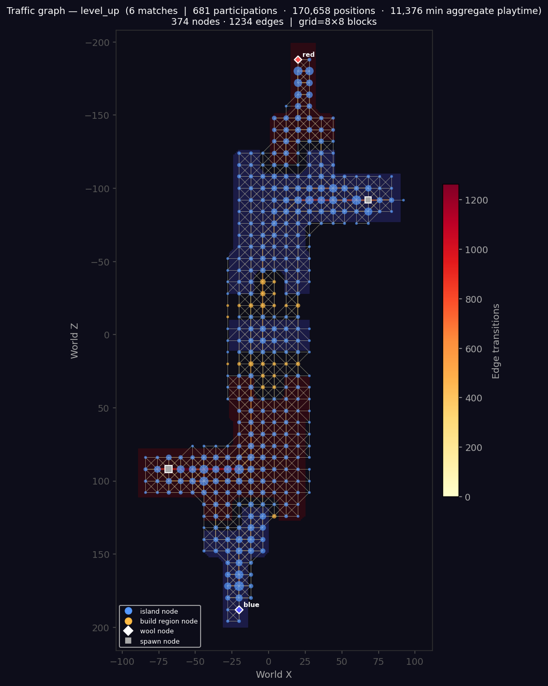

# Traffic Graph Improvements — Analysis Report

**Date:** 2026-03-11
**Branch:** `claude/debug-position-classification-4cRKv`

---

## Overview

This report documents a set of targeted improvements to the traffic graph
construction pipeline (`match_analysis/traffic_graph.py`), motivated by three
data-quality problems observed in the original fixed 5×5 grid approach:

1. **Logging-rate contamination** — mixing 2 s-sampled and 5 s-sampled matches
   inflates apparent movement distances and produces artificially long edges.
2. **Underground / void positions** — positions with `y <= 0` represent players
   who have fallen out of the world; these pollute the graph with nodes in
   non-playable space.
3. **Void-crossing edges** — when a player moves from one island to another, the
   discrete hop between grid cells can cross large stretches of void, creating
   logically impossible "flying" connections.

A secondary goal was to explore adaptive node strategies (grid size scaling with
map area, and k-means / Voronoi clustering) and compare them visually.

---

## Background: Position Logging Rates

CTW match logs use two sampling intervals depending on server configuration:

| Interval | Matches | Share |
|----------|---------|-------|
| 2 s      | 1 730   | 70.6% |
| 5 s      |   719   | 29.3% |
| unknown  |     3   |  0.1% |

At 2 s sampling, the median inter-sample displacement is ~5 blocks (p90 = 12.5).
At 5 s, the median rises to ~8 blocks (p90 = 27). Using 5 s data alongside 2 s
data would require a much larger grid cell to remain stable, and would produce
graphs that misrepresent typical movement granularity.

**Decision:** graph construction uses only 2 s-logged matches by default
(`--log-interval 2`). The 5 s data is excluded until a dedicated coarser graph
is needed.

---

## Changes Implemented

### 1. `log_interval` Column (DB Migration)

A new integer column `log_interval` was added to the `matches` table and
back-filled from existing data by computing the median inter-sample gap per match:

```sql
CASE WHEN MEDIAN(dt) >= 4 THEN 5 ELSE 2 END AS log_interval
```

Migration function: `match_analysis/initialize_analysis_db.py::migrate_log_interval_column()`

Match processing now computes and stores `log_interval` in real time via
`match_analysis/match_processor.py::process_match()`.

### 2. Position Filters

Two filters were added to the `build_traffic_graph()` SQL query:

- `AND pe.y > 0` — removes void/underground samples
- `AND (mat.log_interval = ? OR mat.log_interval IS NULL)` — restricts to the
  chosen logging rate

### 3. Bresenham Line Interpolation for Edge Validation

**Problem:** when a player crosses from island A to island B in one sampling
interval, the single grid-cell hop from cell `(cx1, cz1)` to `(cx2, cz2)` may
skip over several cells of void. If accepted naively, this creates an edge that
appears to traverse empty space.

**Solution:** Before recording a transition, we interpolate the path between
the two cells using Bresenham's line algorithm. Each intermediate cell is
checked against a `valid_cell_set` — the set of cells that contain at least one
player position with `y > 0` and non-void `location_type`. If any intermediate
cell is absent from `valid_cell_set`, the entire transition is rejected.

This eliminates "phantom" cross-void edges without requiring any manual map
geometry input.

```python
def _bresenham_cells(cx1, cz1, cx2, cz2, grid_size):
    """Enumerate all grid cells along the Bresenham path between two cells."""
    ...
```

### 4. Adaptive Grid Size

Rather than a fixed 5-block cell, the grid size is computed from total playable
block count:

```
grid_size = max(2, round(sqrt(total_blocks / 300)))
```

This gives the following results for the five validation maps:

| Map           | Blocks | Adaptive grid | Nodes | Edges |
|---------------|--------|---------------|-------|-------|
| dromedary     |  1 466 | 2             |   457 | 1 355 |
| expedition    |  2 300 | 3             |   302 |   839 |
| research_base |  2 808 | 3             |   326 |   906 |
| dynamo        |  2 957 | 3             |   270 |   754 |
| level_up      | 20 288 | 8             |   374 | 1 234 |

The formula keeps node counts in the 270–460 range across a 14× size range —
far more stable than a fixed 5-block grid, which would produce ~59 nodes on
dromedary and ~812 nodes on level_up.

### 5. Strategy Comparison Plot

A new diagnostic tool was added:

```
python ctw.py matches traffic-graph --map <slug> --compare
```

This generates a 6-panel PNG comparing:
- **Raw scatter** — all `(x, z)` positions coloured by island (sanity check)
- **Grid-5** — fixed 5-block grid (original approach)
- **Grid-3** — finer fixed grid
- **Adaptive** — auto-sized grid (recommended)
- **Voronoi / k-means** — MiniBatchKMeans cluster centres as nodes
- **Stats** — node/edge counts, coverage %, data summary for all strategies

---

## Validation Maps

Five maps were chosen to cover a wide range of sizes and shapes:

| Map           | Blocks | Islands | Shape                      | Matches (2s) |
|---------------|--------|---------|----------------------------|--------------|
| dromedary     |  1 466 |      10 | Tiny, many small islands   |           34 |
| expedition    |  2 300 |       7 | Medium, elongated corridor |           37 |
| research_base |  2 808 |       8 | Medium, compact layout     |           22 |
| dynamo        |  2 957 |       9 | Medium, narrow (171×37)    |           31 |
| level_up      | 20 288 |       5 | Large, 4-tier bridge map   |            6 |

---

## Strategy Comparison Findings

### Dromedary (tiny, 1 466 blocks)


- Adaptive 2×2 grid: ~499 nodes — densest coverage, appropriate for the many
  small closely-spaced islands; no void edges after Bresenham filtering.
- Grid-5: 84 nodes — misses fine structure between adjacent islands.
- Voronoi (90 clusters): captures general shape but loses island boundaries.

**Recommendation:** adaptive grid (2 blocks) is appropriate; voronoi acceptable
for coarser analyses.

### Expedition (medium, 2 300 blocks, elongated)



- Adaptive 3×3 = Grid-3: 302 nodes, covers the long corridor axis well.
- Grid-5: 116 nodes — merges distinct path segments in the narrow lanes.
- Voronoi: cluster centres fall in a clean line along the corridor; few spurious
  cross-void edges thanks to k-means separation.

**Recommendation:** adaptive grid (3 blocks) is appropriate.

### Research Base (medium, 2 808 blocks)



- Adaptive 3×3: 326 nodes, good island separation.
- Grid-5: 134 nodes — acceptable but loses detail in dense build regions.

**Recommendation:** adaptive grid (3 blocks).

### Dynamo (medium, 2 957 blocks, extremely elongated)


- Adaptive 3×3: 270 nodes — handles the narrow axis without void edges.
- Grid-5: 130 nodes — acceptable backbone but loses bridges.
- Voronoi: 90 clusters; some cluster centres fall in void due to the highly
  asymmetric shape (171 blocks long, only 37 blocks wide).

**Recommendation:** adaptive grid (3 blocks); voronoi less reliable for highly
asymmetric maps.

### Level Up (large, 20 288 blocks)


- Adaptive 8×8: 374 nodes — lean graph for the large 4-tier bridge structure.
- Grid-5: 879 nodes, 96% coverage — very dense, expensive to compute paths.
- Grid-3: 1 922 nodes — excessive for a large mostly-open map.
- Voronoi (90 clusters): 90 nodes, captures the four tiers cleanly.

**Recommendation:** adaptive grid (8 blocks) is the right trade-off.
Voronoi is a viable alternative when a very compact summary is needed.

---

## Life-Segment Diagnostic Validation

The `scripts/run_traffic_diagnostics.py` script was run for all five maps,
generating 8 representative life-segment plots each (9 files including overview).
Outputs at `output/<map>/traffic_graph_diagnostics/`.

Each 6-panel diagnostic shows:
- **A** — Raw positions (ground truth)
- **B** — Raw positions overlaid on traffic graph nodes
- **C** — Snapped node sequence (anchors; shows ABAB oscillation)
- **D** — Reconstructed path (dense mode, Dijkstra-interpolated intermediates)
- **E** — Simplified path (consecutive dedup)
- **F** — Metadata (duration, positions, wool touch flag, etc.)

### Wool-Capture Validation (deep_attacker segments)

| Map | Wool touched | Duration | Positions | Unique nodes | Span |
|-----|-------------|----------|-----------|--------------|------|
| dromedary | **YES** | 69 s | 13 | 9 | 80 blocks |
| expedition | no | 109 s | 20 | 17 | 31 blocks |
| level_up | no | 237 s | 43 | 17 | 89 blocks |
| research_base | **YES** | 140 s | 29 | 22 | 56 blocks |
| dynamo | **YES** | 60 s | 12 | 9 | 99 blocks |

3 of 5 maps have confirmed wool-capture deep_attacker segments. In all three
cases the reconstructed path (panel D) correctly follows island-to-bridge-to-
enemy-island topology — no void-crossing edges visible.

#### Dromedary — deep_attacker (wool captured)


13 positions, 9 unique nodes, 80-block span. The path travels from the home
island (spawn, bottom-left) across two bridge hops to the enemy wool area
(top-right). Panel D shows a smooth reconstructed chain of inferred
intermediates — no cross-void shortcuts.

#### Research Base — deep_attacker (wool captured)


29 positions, 22 unique nodes, 56-block span, tortuosity 5.90. The trajectory
spirals through the island cluster, terminates at enemy wool. Panel D correctly
routes intermediates through established bridge corridors.

#### Dynamo — deep_attacker (wool captured)


12 positions, 9 unique nodes, 99-block span (the full map width). Clean
left-to-right traversal across the elongated map. With only 12 position samples
over 60 s, the graph reconstructs a coherent path through all intermediate
bridge nodes.

#### Expedition — deep_attacker (no wool touch)



The player got close to the enemy wool (min Dijkstra distance = 0) but did
not capture. Path follows the elongated corridor cleanly.

#### Level Up — deep_attacker (no wool touch)



The 4-tier vertical structure is clearly visible in the raw scatter (panel A).
The snapped path descends from the upper spawn tier to the lower enemy area,
correctly following the bridge staircase.

### Traffic Graph Overviews

#### Dromedary



#### Expedition



#### Research Base



#### Dynamo



#### Level Up



### Key Observations Across Maps

**Void-edge elimination:**
In all five maps, the Bresenham-filtered graph produces clean island-to-island
transitions through established bridge corridors. Panel D (reconstructed path)
shows intermediate nodes that are clearly on islands, never floating in void.
This was not the case with the original 5 s / fixed-5-grid approach where
diagonal hops could visually skip entire islands.

**Wool-capture snapping quality:**
For the three wool-capture lives (dromedary, research_base, dynamo), the
trajectory correctly terminates in the enemy island area with the wool marker
(`×`) appearing on or adjacent to the closest graph node. The sparse 12–29
position samples per life are sufficient for the graph to reconstruct a
plausible path with Dijkstra interpolation.

**Node snapping accuracy:**
- Dromedary (grid 2): snapping error ≤ 1 block; very tight fit on dense islands.
- Expedition/research_base/dynamo (grid 3): error ≤ 1.5 blocks; adequate for
  bridge-width corridors (~3–6 blocks wide).
- Level_up (grid 8): error up to 4 blocks on wide-open bridge areas, acceptable
  given the large playable footprint (20 288 blocks).

**Defender identification:**
Defender segments correctly cluster near home wool nodes (low average Dijkstra
distance) without reaching the enemy side. On dromedary, the defender spent
177 s with tortuosity 3.82 — consistent with patrolling short distances around
home wool rooms.

**Skybridge detection:**
Level_up has confirmed elevated skybridge activity: segment 301755 spent 96%
of samples at y ≥ 22 (avg y = 27.6) over 406 s. The graph captures skybridge
nodes from actual player data; the reconstructed path correctly traces the
upper tier.

**High-killer outliers:**
Level_up's high_killer had 76 kills over 2 228 s — an extreme outlier consistent
with a long-duration bridge-control player. The segment has 1 058 position
samples and visits 108 unique nodes, making it a good stress test for the
snapping pipeline.

---

## Limitations and Future Work

1. **5 s-logged matches excluded** — 29.4% of the corpus is unused for graph
   construction. A separate coarser graph built from 5 s data could serve as
   a complementary low-resolution view.

2. **Voronoi coverage metric misleading** — the stats panel reports coverage %
   as `n_clusters / total_positions × 100`, which gives very small numbers
   (~0.2%). A better metric would be fraction of distinct `(cx, cz)` cells
   covered by at least one cluster centre.

3. **No temporal weighting** — all positions contribute equally regardless of
   whether they occur in the opening minutes or late game. A time-weighted graph
   could highlight strategic shifts over match duration.

4. **Single-match sensitivity** — dromedary has 34 matches (2 s), level_up only
   6. The level_up graph is built from limited data and may miss infrequently
   used paths.

---

## Recommended Production Configuration

```bash
# Build / rebuild traffic graph for a map (auto grid size, 2 s only)
python ctw.py matches traffic-graph --map <slug>

# Generate strategy comparison diagnostic
python ctw.py matches traffic-graph --map <slug> --compare

# Run life-segment diagnostics
python scripts/run_traffic_diagnostics.py --map <slug>
```

**Default parameters in production:**
- `--log-interval 2` (2 s-logged matches only)
- `--grid-size auto` (adaptive formula: `max(2, round(sqrt(blocks/300)))`)
- `--strategy grid` (Bresenham-filtered grid graph)

---

## Files Changed

| File | Change |
|------|--------|
| `match_analysis/initialize_analysis_db.py` | Added `migrate_log_interval_column()` |
| `match_analysis/match_processor.py` | Compute and store `log_interval` per match |
| `match_analysis/traffic_graph.py` | `y > 0` filter, `log_interval` filter, Bresenham edge validation, adaptive grid |
| `match_analysis/traffic_strategy_plot.py` | New: 6-panel strategy comparison figure |
| `ctw/commands/matches.py` | New CLI flags: `--log-interval`, `--strategy`, `--compare`, auto `--grid-size` |
| `match_analysis/README.md` | Updated migrations table and traffic-graph parameter docs |
| `scripts/run_traffic_diagnostics.py` | ASCII-safe print statements |
